#  ArgoCD Workshop

**2024.04**

Workshop recording available [here](https://sap.sharepoint.com/teams/GCS-SRE/Shared%20Documents/Forms/AllItems.aspx?newTargetListUrl=%2Fteams%2FGCS%2DSRE%2FShared%20Documents&viewpath=%2Fteams%2FGCS%2DSRE%2FShared%20Documents%2FForms%2FAllItems%2Easpx&id=%2Fteams%2FGCS%2DSRE%2FShared%20Documents%2FSRE%20Learning%20HUB%2FKT%20Sessions%2FArgoCD&viewid=ca8d3541%2D10af%2D4289%2Daf68%2Dd2a366462411).

**GCID SRE**

**Platform Engineering Team**

- [ArgoCD Workshop](#argocd-workshop)
  - [Requirements](#requirements)
  - [Day 1 / Section 1](#day-1--section-1)
    - [About ArgoCD](#about-argocd)
    - [Installing ArgoCD](#installing-argocd)
    - [Declarative Setup](#declarative-setup)
  - [Day 1 / Section 1 / Lab](#day-1--section-1--lab)
    - [Installing ArgoCD](#installing-argocd-1)
    - [Configure GitHub repository access for ArgoCD](#configure-github-repository-access-for-argocd)
    - [Deploy a simple Application with ArgoCD using your repository](#deploy-a-simple-application-with-argocd-using-your-repository)
    - [Modifying our test application the GitOps way using ArgoCD](#modifying-our-test-application-the-gitops-way-using-argocd)
    - [Delete one k8s resource, and delete the whole Application with ArgoCD](#delete-one-k8s-resource-and-delete-the-whole-application-with-argocd)
  - [Day 1 / Section 2](#day-1--section-2)
    - [Kustomize](#kustomize)
  - [Day 1 / Section 2 / Lab](#day-1--section-2--lab)
    - [Kustomize examples](#kustomize-examples)
  - [Day 1 / Section 3](#day-1--section-3)
    - [ArgoCD vault plugin - AVP](#argocd-vault-plugin---avp)
      - [Installation](#installation)
  - [Day 1 / Section 3 / Lab](#day-1--section-3--lab)
    - [Playing with ArgoCD Vault Plugin](#playing-with-argocd-vault-plugin)
    - [Installing AVP](#installing-avp)
  - [Day 2 / Section 1](#day-2--section-1)
    - [ArgoCD directory structure combined with kustomize in the infrastructure repo](#argocd-directory-structure-combined-with-kustomize-in-the-infrastructure-repo)
  - [Day 2 / Section 1 / Lab](#day-2--section-1--lab)
    - [Creating a new directory structure for ArgoCD with kustomize](#creating-a-new-directory-structure-for-argocd-with-kustomize)
  - [Day 2 / Section 2](#day-2--section-2)
    - [Application of Applications](#application-of-applications)
  - [Day 2 / Section 2 / Lab](#day-2--section-2--lab)
    - [Adding some new simple apps to your my-argocd-app repository](#adding-some-new-simple-apps-to-your-my-argocd-app-repository)
    - [Creating the Application of Application](#creating-the-application-of-application)
  - [Day 2 / Section 3](#day-2--section-3)
    - [Updating an Application using the Application of Applications concept](#updating-an-application-using-the-application-of-applications-concept)
  - [Day 2 / Section 3 / Lab](#day-2--section-3--lab)
    - [GitOps test](#gitops-test)
    - [Manual execution of the ArgoCD workflow step by step.](#manual-execution-of-the-argocd-workflow-step-by-step)
  - [Day 2 / Extra session](#day-2--extra-session)
    - [Playing with ArgoCD Web GUI](#playing-with-argocd-web-gui)


## Requirements

During the workshop, you will need access to the following tools and resources:

> [!NOTE]
> This workbook was only tested on WSL2 Ubuntu 22.04.4 LTS, it may work on other Linux distributions and operating systems, but your mileage may vary.

- docker
  - Tested version: `26.0.0`
- minikube
  - Tested minikube version: `v1.32.0`
  - Tested kubernetes version: `v1.28.3`
- kubectl command-line tool
  - Tested kubectl client version: `v1.28.8`
- kustomize command-line tool
  - Tested kustomize version: `v5.0.4-0.20230601165947-6ce0bf390ce3`
- git command-line tool
- SAP VPN connection (F5 or Global Protect)
- Read access to the repository: https://github.tools.sap/gcs-sre/argocd-workshop.git
- Be able to sign in to [SAP GitHub](https://github.tools.sap/), alternatively to [GitHub](https://github.com/) with a private account
  - Be able to create any new repository
  - Prepare a personal access token for repositories (Settings → Developer Settings → Personal Access Token → Tokens (classic) → Generate New Token (classic) → Fill out the form → click Generate token → Copy and save the generated Token)
- shell console (ideally bash or zsh)
- read access to our Vault (https://vault.tools.sap/ui/vault/secrets/kv/kv/list?namespace=gcs%2Fsre)

## Day 1 / Section 1

### About ArgoCD

[Source documentation](https://argo-cd.readthedocs.io/en/stable/)

`ArgoCD` is a declarative, GitOps continuous delivery tool **for kubernetes**.

**Declarative:** Declarative programming is a high-level programming concept, which is the opposite of imperative programming. It is a programming approach in which coders write code that describes what they want to do and what results they want to achieve, rather than how they will achieve the results. It is the job of the program's compiler to figure out the "how".

**GitOps:** GitOps uses git repositories as a single source of truth to deliver infrastructure as code. All changes to code are tracked, making updates easy while also providing version control should a rollback be needed.

**Continuous delivery  (CD):** Continuous delivery is a software development practice where code changes are automatically prepared for a release to production.

With continuous delivery, every code change is built, tested, and then pushed to a non-production testing or staging environment. There can be multiple, parallel test stages before a production deployment. The difference between continuous delivery and continuous deployment is the presence of a manual approval to update to production. With continuous deployment, production happens automatically without explicit approval.

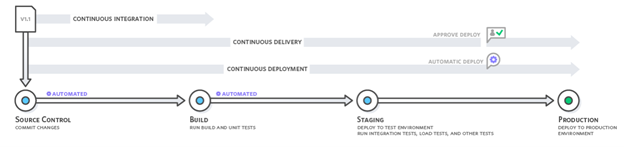

**How ArgoCD works:**

ArgoCD follows the GitOps pattern of using git repositories as the source of truth for defining the desired application state. Kubernetes manifests can be specified in several ways:

- kustomize applications
- helm charts
- jsonnet files
- Plain directory of YAML/json manifests
- Any custom config management tool configured as a config management plugin

ArgoCD __automates the deployment__ of the desired application states in the __specified target environments__ (k8s). Application deployments __can track updates to branches, tags, or pinned to a specific version of manifests at a git commit.__

ArgoCD is implemented as a Kubernetes controller which continuously monitors running applications and compares the current, live state against the desired target state (as specified in the git repository). A deployed application whose live state deviates from the target state is considered `OutOfSync`. ArgoCD reports & visualizes the differences, while providing facilities to automatically or manually sync the live state back to the desired target state. Any modifications made to the desired target state in the git repo can be automatically applied and reflected in the specified target environments.

### Installing ArgoCD

Requirements

- Kubernetes cluster connection (working `kubeconfig` file)
- Installed `kubectl` command-line tool

ArgoCD can be installed with many tools, like helm, kustomize. We choose the plain yaml manifest file, since later we will use kustomize to make the necessary changes/patches to the default yaml manifest.

The description of the installation can be found in the next lab section, when we ourselves will perform the installation on our own minikube cluster.

### Declarative Setup

[Source documentation](https://argo-cd.readthedocs.io/en/stable/operator-manual/declarative-setup/#atomic-configuration)

ArgoCD applications, projects and settings can be defined declaratively using Kubernetes manifests. These can be updated __using kubectl apply, without needing to touch the argocd command-line tool or ArgoCD GUI.__

All resources, including Application and AppProject specs, have to be installed in the ArgoCD namespace (by default argocd).

Due to automation, it is important for us to be aware of this possibility. The infrastructure pipeline of the GCID SRE PE team installs each ArgoCD instance as well as the applications managed by the ArgoCD instances without manual configuration thanks to the declarative setup option.

## Day 1 / Section 1 / Lab

For some of the labs, we will use pre-made manifests that can be found in the https://github.tools.sap/gcs-sre/argocd-workshop.git repository (as well as this manual). So, before starting the labs, clone the repository to your local computer:

```shell
$ cd <your_local_directory_containing_git_repos>
$ git clone https://github.tools.sap/gcs-sre/argocd-workshop.git
$ cd argocd-workshop
```

### Installing ArgoCD

Be sure that you are in the local cloned directory of the argocd-workshop repository.

Check that you minikube cluster is running and that you have access to it with the `minikube` command-line tool:

```shell
$ minikube status

    # Expected output:
    # minikube
    # type: Control Plane
    # host: Running
    # kubelet: Running
    # apiserver: Running
    # kubeconfig: Configured
```

Create the default `argocd` namespace:

```shell
$ kubectl create namespace argocd

    # Expected output:
    # namespace/argocd created
```

Install ArgoCD using install.yaml manifest:

```shell
$ kubectl -n argocd apply -f Day1/Section1/install.yaml

    # Expected output:
    # customresourcedefinition.apiextensions.k8s.io/applications.argoproj.io created
    # customresourcedefinition.apiextensions.k8s.io/applicationsets.argoproj.io created
    # customresourcedefinition.apiextensions.k8s.io/appprojects.argoproj.io created
    # serviceaccount/argocd-application-controller created
    # serviceaccount/argocd-applicationset-controller created
    # serviceaccount/argocd-dex-server created
    # serviceaccount/argocd-notifications-controller created
    # serviceaccount/argocd-redis created
    # serviceaccount/argocd-repo-server created
    # serviceaccount/argocd-server created
    # role.rbac.authorization.k8s.io/argocd-application-controller created
    # role.rbac.authorization.k8s.io/argocd-applicationset-controller created
    # role.rbac.authorization.k8s.io/argocd-dex-server created
    # role.rbac.authorization.k8s.io/argocd-notifications-controller created
    # role.rbac.authorization.k8s.io/argocd-server created
    # clusterrole.rbac.authorization.k8s.io/argocd-application-controller created
    # clusterrole.rbac.authorization.k8s.io/argocd-applicationset-controller created
    # clusterrole.rbac.authorization.k8s.io/argocd-server created
    # rolebinding.rbac.authorization.k8s.io/argocd-application-controller created
    # rolebinding.rbac.authorization.k8s.io/argocd-applicationset-controller created
    # rolebinding.rbac.authorization.k8s.io/argocd-dex-server created
    # rolebinding.rbac.authorization.k8s.io/argocd-notifications-controller created
    # rolebinding.rbac.authorization.k8s.io/argocd-server created
    # clusterrolebinding.rbac.authorization.k8s.io/argocd-application-controller created
    # clusterrolebinding.rbac.authorization.k8s.io/argocd-applicationset-controller created
    # clusterrolebinding.rbac.authorization.k8s.io/argocd-server created
    # configmap/argocd-cm created
    # configmap/argocd-cmd-params-cm created
    # configmap/argocd-gpg-keys-cm created
    # configmap/argocd-notifications-cm created
    # configmap/argocd-rbac-cm created
    # configmap/argocd-ssh-known-hosts-cm created
    # configmap/argocd-tls-certs-cm created
    # secret/argocd-notifications-secret created
    # secret/argocd-secret created
    # service/argocd-applicationset-controller created
    # service/argocd-dex-server created
    # service/argocd-metrics created
    # service/argocd-notifications-controller-metrics created
    # service/argocd-redis created
    # service/argocd-repo-server created
    # service/argocd-server created
    # service/argocd-server-metrics created
    # deployment.apps/argocd-applicationset-controller created
    # deployment.apps/argocd-dex-server created
    # deployment.apps/argocd-notifications-controller created
    # deployment.apps/argocd-redis created
    # deployment.apps/argocd-repo-server created
    # deployment.apps/argocd-server created
    # statefulset.apps/argocd-application-controller created
    # networkpolicy.networking.k8s.io/argocd-application-controller-network-policy created
    # networkpolicy.networking.k8s.io/argocd-applicationset-controller-network-policy created
    # networkpolicy.networking.k8s.io/argocd-dex-server-network-policy created
    # networkpolicy.networking.k8s.io/argocd-notifications-controller-network-policy created
    # networkpolicy.networking.k8s.io/argocd-redis-network-policy created
    # networkpolicy.networking.k8s.io/argocd-repo-server-network-policy created
    # networkpolicy.networking.k8s.io/argocd-server-network-policy created
```

> [!NOTE]
> The `kubectl apply` command in the official ArgoCD documentation always installs the latest ArgoCD version from the Internet. Due to version traceability in our production and the ArgoCD workshop, we use a fixed version stored in our own repository.

Verify that the ArgoCD installation was successful and that the required pods are running:

```shell
$ kubectl -n argocd get pods

    # Expected output:
    # NAME                                                READY   STATUS    RESTARTS   AGE
    # argocd-application-controller-0                     1/1     Running   0          5m27s
    # argocd-applicationset-controller-584f68b9d7-7tmt6   1/1     Running   0          5m28s
    # argocd-dex-server-8577d9498b-z5bbj                  1/1     Running   0          5m28s
    # argocd-notifications-controller-564dcb4995-hv878    1/1     Running   0          5m28s
    # argocd-redis-66d9777b78-pb7p7                       1/1     Running   0          5m28s
    # argocd-repo-server-58c94b5cbf-btfwg                 1/1     Running   0          5m28s
    # argocd-server-b8bd4f4b5-54pc4                       1/1     Running   0          5m27s
```

Let's test if we can access ArgoCD.

By default, the ArgoCD API server and GUI is not exposed with an external IP. To access the ArgoCD GUI, we will use kubectl port-forwarding. It is recommended to open a new shell console tab where you can run the port-forward command as it will block the terminal until you stop the port-forwarding:

```shell
$ kubectl -n argocd port-forward svc/argocd-server -n argocd 8443:443

    # Expected output:
    # Forwarding from 127.0.0.1:8443 -> 8080
    # Forwarding from [::1]:8443 -> 8080
```

The ArgoCD GUI can then be accessed using https://localhost:8443 from your browser. Open it and accept the certificate warning as this service only has a self signed certificate for testing purposes.

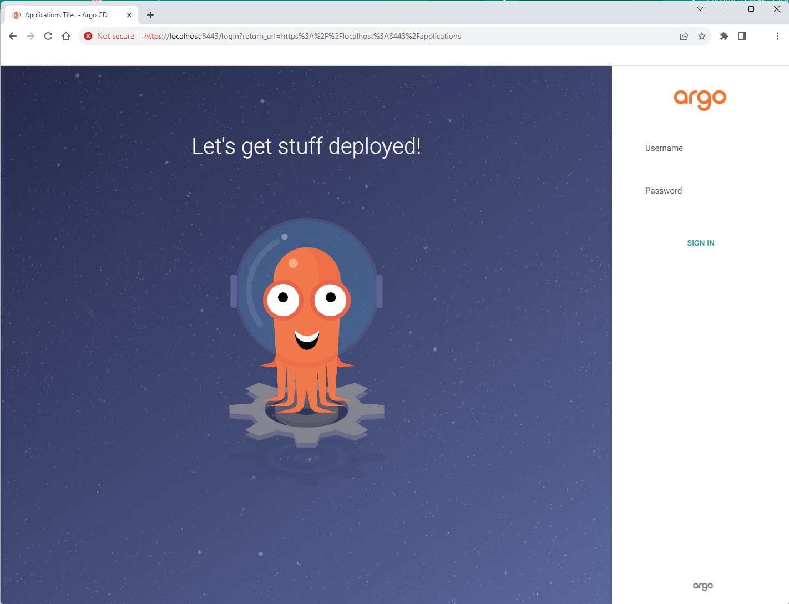

The initial password for the admin account is auto-generated and stored as clear text in the field `password` in a secret named `argocd-initial-admin-secret`in your ArgoCD installation namespace. You can simply retrieve this password using the argocd CLI:

```shell
$ kubectl -n argocd get secrets argocd-initial-admin-secret -o jsonpath="{.data.password}" | base64 -d

    # The output of this command is the password. The username is "admin"
```

Leave the Web GUI open because we will use it later.

### Configure GitHub repository access for ArgoCD

Since ArgoCD is a GitOps tool, a repository must be configured for operations where we will store the deployment manifests our applications.

Although almost everything can be configured on the GUI, we will create the repository connection declaratively. We will only use the GUI for verification.

- Open "your repositories" page on GitHub: `https://github.tools.sap/<your_username>?tab=repositories` or `https://github.com/<your_GitHub_username>?tab=repositories`
- Click on the `New` button to create a new repository.
- The `owner` should be you. Type the repository name `my-argocd-apps`. This can be a `Private` repository. Click on `Add a README file` check box and click on `Create repository` button.
- You should use this repository in upcoming labs.

Now you should have an empty repository owned by you. We will now configure ArgoCD to access this repository for deploying applications.

The declarative setup of repository credentials is described [here - repository credentials](https://argo-cd.readthedocs.io/en/stable/operator-manual/declarative-setup/#repository-credentials)

We are going to use a prepared example manifest located in the workshop repository where the secret type label is `argocd.argoproj.io/secret-type: repo-creds`. The reason we're using this approach is because this way we won't only configure one particular repository but every repository accessed via HTTPS whose URL is prefixed with `https://github.tools.sap/<your_GitHub_username>`. In other words, ArgoCD will use the username stored in the key `username` and a personal access token stored in the key `password` of the secret `private-repo-creds` for authenticating with all repositories owned by you on GitHub. This is the so-called credential template.

In order for ArgoCD to use a credential template for any given repository, the following conditions must be met:

- The repository must either not be configured at all, or if configured, must not contain any credential information (i.e. contain none of sshPrivateKey, username, password )
- The URL configured for a credential template (e.g. `https://github.tools.sap/<your_GitHub_username>`) must match as prefix for the repository URL (e.g. `https://github.tools.sap/<your_GitHub_username>/my-argocd-apps`).

Be sure that you are in the local cloned directory of the `argocd-workshop` repository.

Edit the file `Day1/Section1/github-access-secret.yaml` (use your favourite editor):

```yaml
# Change the url according to your own github profile
url: https://github.tools.sap/<your_GitHub_username>

# Enter your real username and password
  password: <your personal_access_token>
  username: <your_GitHub_username>

# Remember that these are considered sensitive data!
# We will keep everything as a local copy and will not synchronize it with the repository.
```

Save the file. Be sure that it contains valid information. Apply the manifest to create the repo connection:

```shell
$ kubectl -n argocd apply -f Day1/Section1/github-access-secret.yaml

  # Expected output:
  # secret/argoproj-https-creds created
```

Now we will use the Web GUI to verify that the repository connection is indeed established.

- Click on `Settings` in the menu on the left
- Click on `Repositories`

Now, you should see that there is a `Credentials template URL`:

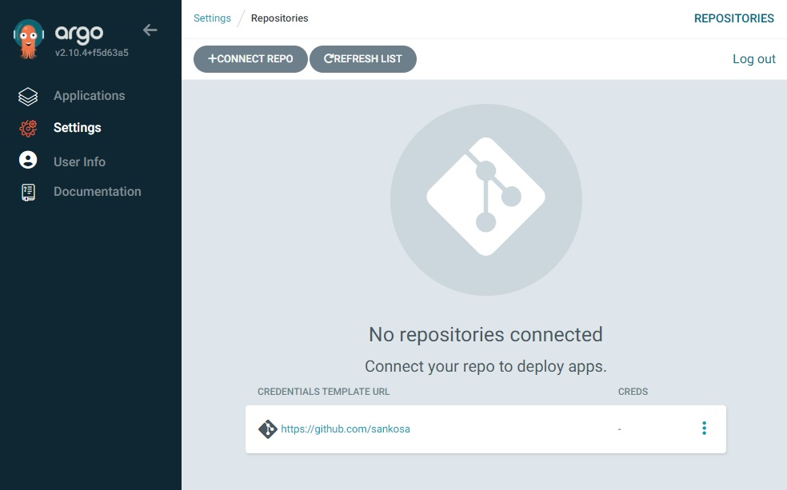

> [!NOTE]
> Don't be misled by the sentence "No repositories connected", because as mentioned earlier, we created a template credential that is not only valid for one repository, but for all repositories owned by a specific user or organization (in this case you).

### Deploy a simple Application with ArgoCD using your repository

For the sake of simplicity, we will deploy a very simple application, which will essentially be a k8s `ConfigMap`.

In your newly created repository (`https://github.tools.sap/<your_GitHub_username>/my-argocd-apps`), let's create a new directory, and add a new file (Replace the placeholders with your own values):

```shell
# export your GitHub username into an environment variable so that we can reuse it in the following commands:
$ export MY_GITHUB_USER="<your_GitHub_username>"
# check it:
$ echo $MY_GITHUB_USER

# clone your repository
$ git clone https://github.tools.sap/$MY_GITHUB_USER/my-argocd-apps.git

# Open your new cloned repository directory
$ cd my-argocd-apps

# create a new directory
$ mkdir my-first-app

# create a configmap
$ cat <<EOF > my-first-app/configmap.yaml
apiVersion: v1
kind: ConfigMap
metadata:
  name: my-test-configmap
data:
  player_initial_lives: "3"
  ui_properties_file_name: "user-interface.properties"
  game.properties: |
    enemy.types=aliens,monsters
    player.maximum-lives=5    
  user-interface.properties: |
    color.good=purple
    color.bad=yellow
    allow.textmode=true    
EOF

# Push your change/commit to your repository
$ git add my-first-app/

$ git commit -m "Create new configmap"

# Use your own username and personal access token to push the commits to github
$ git push
```

Verify that the new directory with the file has been pushed successfully to your own repository.

Now, we will create our first ArgoCD Application in a declarative way. Execute the following steps:

```shell
# Be sure that you are in your "my-argocd-apps" repo's directory
$ pwd

# Let's create the ArgoCD Application manifest to deploy our previously created app (configmap)
$ mkdir ArgoCD
$ cat <<EOF > ArgoCD/application.yaml
---
apiVersion: argoproj.io/v1alpha1
kind: Application
metadata:
  name: my-test-app
  namespace: argocd
spec:
  project: default
  source:
    repoURL: https://github.tools.sap/$MY_GITHUB_USER/my-argocd-apps.git
    targetRevision: main
    path: my-first-app
  destination:
    namespace: my-test-namespace
    server: https://kubernetes.default.svc
  syncPolicy:
    automated:
      selfHeal: true
    retry:
      backoff:
        duration: 15s
        factor: 2
        maxDuration: 5m
      limit: 15
    syncOptions:
    - CreateNamespace=true
EOF

# Check that the ArgoCD application manifest file is there
$ cat ArgoCD/application.yaml

# Push your change/commit to your repo
$ git add ArgoCD/
$ git commit -m "Create new ArgoCD application manifest"
# Use your own username and personal access token to push the commits to github
$ git push
```

> [!NOTE]
> The ArgoCD application manifest file (application.yaml) contains every important information, how our application should be synchronized by Argocd:
> - source repository URL
> - source repository branch
> - the directory where the application manifests are located (path)
> - destination cluster
> - destination namespace
> - sync policy
> - etc...
>
> If we were to use the web GUI to create an Application, we would have to enter the same information.

And now, create the application with a simple `kubectl apply` command:

```shell
# Be sure that you are in your "my-argocd-apps" repo's directory
$ pwd

# Create the ArgoCD Application
$ kubectl apply -f ArgoCD/application.yaml

  # Expected output:
  # application.argoproj.io/my-test-app created
```

ArgoCD will start to fetch the application manifest from our repository according to the Application definition (`application.yaml`) and begin to deploy and snychronize the resources (in our case it's just a simple `ConfigMap` for now).

Now, we can confirm in many ways that a new application has been created. Let's see how to do that.

Execute the following command:

```shell
$ kubectl -n argocd get application

  # Expected output:
  # NAME          SYNC STATUS   HEALTH STATUS
  # my-test-app   Synced        Healthy
```

We can see that the new `my-test-app` ArgoCD application has been created and it's `Synced` and `Healthy`.

Open the web GUI, and click on `Applications` in the left menu bar. You can see the Application with a short info (like name, status, source, destination...):

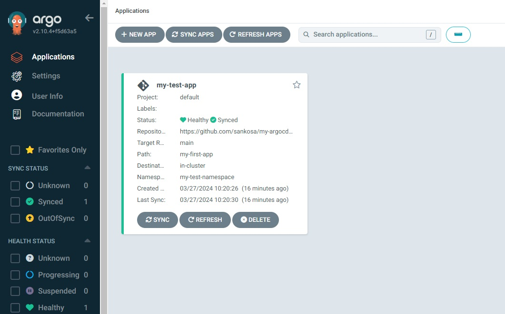

You also can click on the Application tile to see more information about the application:

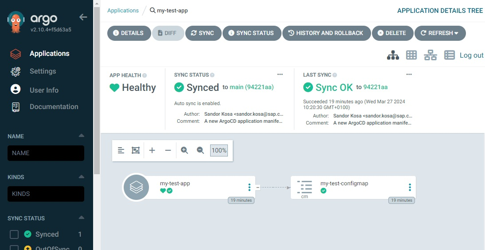

We will get to know the web GUI later, but now it is clearly visible that ArgoCD has deployed the configmap we prepared in our github repository in accordance with the application manifest file.

ArgoCD now monitors our application so that it is exactly the same as the state stored in the repository (according to the App definition, ArgoCD synchronizes the app state with the main branch).

For demonstration purposes: Delete the configmap with `kubectl`. ArgoCD will recreate it shortly, because according to the repository state, the configmap should exist in the `my-test-namespace` namespace.

```bash
# delete the configmap
$ kubectl -n my-test-namespace delete configmaps my-test-configmap
  # Expected output:
  # configmap "my-test-configmap" deleted

# wait few secs and get the configmaps
$ kubectl -n my-test-namespace get configmaps my-test-configmap
  # Expected output:
  # NAME                DATA   AGE
  # my-test-configmap   4      43s
```

### Modifying our test application the GitOps way using ArgoCD

In this task, we will see that ArgoCD is indeed a GitOps CD tool. We will modify the test application we just created and deployed without doing anything on the k8s cluster. As GitOps dictates, we will modify the manifest file stored in the git repository, and ArgoCD will synchronize the deployed application according to the file stored in the repository without any manual deploy step.

So, as is described in the ArgoCD Application manifest, our current test ArgoCD Application uses the following source:

```yaml
# repository: repoURL
# branch: targetRevision
# directory contains app manifests: path
  source:
    repoURL: https://github.tools.sap/$MY_GITHUB_USER/my-argocd-apps.git
    targetRevision: main
    path: my-first-app
```

Let's do two changes in our repository:

- Change the existing `https://github.tools.sap/${MY_GITHUB_USER}/my-argocd-apps/blob/main/my-first-app/configmap.yaml` file
- And create a new secret manifest

We expect that after the push to the main branch, the current configmap will be modified with our changes, and the new secret will also be created thanks to ArgoCD.

```shell
# Be sure that you are in your "my-argocd-apps" repo's directory!
$ pwd

# Currently, there is no secret in the test app namespace
$ kubectl -n my-test-namespace get secret
  # Expected output:
  # No resources found in my-test-namespace namespace.

# We have a configmap which is exactly the same what we store on GitHub
$ kubectl -n my-test-namespace get configmap my-test-configmap -o yaml
  # check the output of the configmap

# change the configmap
# player_initial_lives will be changed from 3 to 5
$ sed -i 's/player_initial_lives: "3"/player_initial_lives: "5"/' my-first-app/configmap.yaml

# create a new secret
$ cat <<EOF > my-first-app/secret.yaml
---
apiVersion: v1
kind: Secret
metadata:
  name: my-test-secret
type: Opaque
stringData:
  foo: bar
EOF

# push the commits to the repository
$ git add my-first-app/configmap.yaml my-first-app/secret.yaml
$ git commit -m "Change my-first-app"
$ git push

# wait few seconds. ArgoCD will synchronize the repository
# The reconciliation logic will perform a re-sync on each application every 3 minutes

# Now, we have the secret, without execute any kubectl command on the k8s cluster:
$ kubectl -n my-test-namespace get secret
  # Expected output:
  # NAME             TYPE     DATA   AGE
  # my-test-secret   Opaque   1      2m20s

# And the configmap is also changed - layer_initial_lives is now 5
$ kubectl -n my-test-namespace get configmaps my-test-configmap -o yaml | grep player_initial_lives | grep -v 'annotation'
  # Expected output:
  #   player_initial_lives: "5"
```

Check the Application status with web GUI too.

### Delete one k8s resource, and delete the whole Application with ArgoCD

Perhaps this question has already occurred to you: What happens if I delete a manifest in my repository?

ArgoCD synchronizes all changes by default, but this behavior can be controlled in the case of deletions. This behaviour is defined in the `sync policy`. (You can check the application specification [here](https://argo-cd.readthedocs.io/en/stable/user-guide/application-specification/))

If you check the `application.yaml` manifest, it contains the following `syncPolicy`:

```yaml
  syncPolicy:
    automated:
      selfHeal: true
```

`syncPolicy.automated.prune` is not defined in our application and the default value of this option is `false`. It specifies if resources should be pruned during auto-syncing. We do not use this for security reasons. Resource deletion is always performed in a confirmed manner.

> [!CAUTION]
> If you set `syncPolicy.automated.prune: true`, then the deletion of a manifest in the repository will result in the deletion of the corresponding resource in the cluster during the next auto-sync. This can lead to unexpected results if you are not aware of this behavior. This can lead to entire services being deleted off the cluster, for example, minor configuration mistakes can cause ArgoCD to lose track of resources, so be careful with this option!

Let's test it, see how it works:

```shell
# Be sure that you are in your "my-argocd-apps" repo's directory!!!!
$ pwd

# Delete the secret manifest
$ rm -rf my-first-app/secret.yaml

# Commit and push the change to the repository
$ git rm my-first-app/secret.yaml
$ git commit -m "Remove secret manifest"
$ git push
```

So, our application in the repository now once again only contains a lone `ConfigMap`. Wait few seconds for ArgoCD auto sync (interval is up to 3 mins) and check the application status again (If you don't want to wait, you can click on the sync button in the web GUI):

```shell
# Get ArgoCD application list
$ kubectl -n argocd get app

  # Expected output:
  # $ kubectl -n argocd get app
  # NAME          SYNC STATUS   HEALTH STATUS
  # my-test-app   OutOfSync     Healthy
```

So, the application health status is healthy because the configmap is still there and valid, but the sync status of our application has been changed to `OutOfSync`. Let's open the web GUI to see the reason. Click on the **my-test-app** Application. You will see a little yellow trash icon on the **my-test-secret** tile:

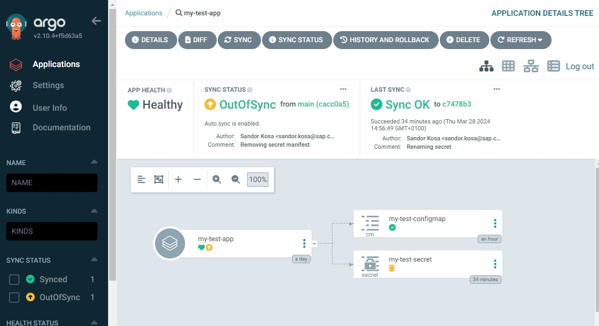

If you click on the **my-test-secret** tile, you will see the reason in the STATUS line:

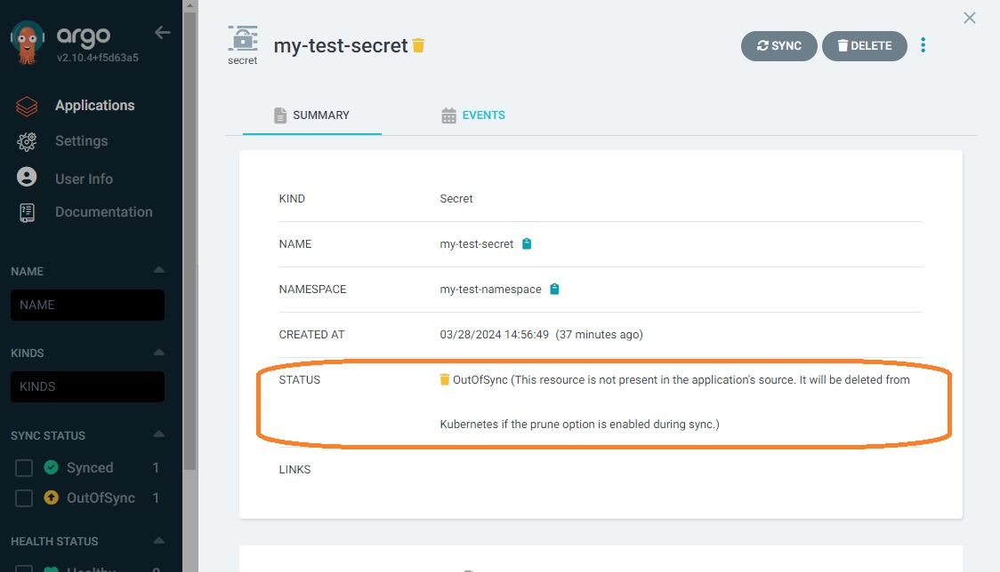

The message is quite clear. **This resource is not present in the application's source. It will be deleted from Kubernetes if the prune option is enabled during sync.** Since the prune option is not enabled we should delete the secret manually. We can delete it with `kubectl` but we also can ask ArgoCD to do this for us in a safe manner: For example, just click on the big **DELETE** button on the secret status page (but not on the App!), confirm the deletion as described with the secret name, choose **FOREGROUND DELETE** and click on the OK button.

ArgoCD is going to delete the secret. After the deletion the Application sync status is "Synced" again.

Now, let's delete the whole application. You can delete it with `kubectl` or with web GUI. But there is one big difference to note here:

- If we delete the app with `kubectl`, the k8s resources remain on the cluster, since we only deleted the app manifest
- If we delete the app with web GUI, the k8s resources belonging to the application are also going to be deleted by ArgoCD

```shell
# Be sure that you are in your "my-argocd-apps" repo's directory!
$ pwd

# Delete the app with kubectl (not the resources!)
$ kubectl -n argocd delete app my-test-app
  # Expected output:
  # application.argoproj.io "my-test-app" deleted

# The resource(s) is/are still there but not the app (we have only one configmap...)
$ kubectl -n argocd get app
  # Expected output:
  # No resources found in argocd namespace.
$ kubectl -n my-test-namespace get configmaps
  # Expected output:
  # NAME                DATA   AGE
  # kube-root-ca.crt    1      29h
  # my-test-configmap   4      60m

# Let's recreate the app to test the deletion with web GUI
$ kubectl apply -f ArgoCD/application.yaml
  # Expected output:
  # application.argoproj.io/my-test-app created
```

Now that we have recreated the Application, we delete it using the web GUI. Click on the `DELETE` button on the **my-test-app** Application tile. Confirm the application name, choose the **Foreground** option and hit OK. Now we have deleted both the application and the resources belonging to the application:

```shell
# There is no app
$ kubectl -n argocd get app
  # Expected output:
  # No resources found in argocd namespace.

# There is no application resource (configmap)
$ kubectl -n my-test-namespace get configmaps
  # Expected output:
  # NAME               DATA   AGE
  # kube-root-ca.crt   1      29h
```

## Day 1 / Section 2

### Kustomize

The main purpose of **kustomize** is very similar to **helm**. Kustomize is a Kubernetes configuration transformation tool that enables you to customize untemplated YAML files, leaving the original files untouched.

Kustomize also has additional features such as:

- generate resources such as `ConfigMap`s and `Secret`s from other representations
- add common labels or annotations
- work with helm chart output
- etc...

Kustomize’s behavior is determined by declarative specifications expressed in a file called `kustomization.yaml`. The kustomize program reads the file and the Kubernetes API resource files it references, then emits complete resources to standard output. This text output can be further processed by other tools, or streamed directly to kubectl for application to a cluster.

Kustomize supports multiple `kustomization.yaml` files which can be nested with references, but kustomize can only interpret a directory if it contains a `kustomization.yaml` file.

Compared to helm, there is no predefined directory structure. A more common use case is that you’ll need multiple variants of a common set of resources, e.g., a development, staging and production variant. For this purpose, kustomize supports the idea of an overlay and a base. Both are represented by a kustomization file. The base declares things that the variants share in common (both resources and a common customization of those resources), and the overlays declare the differences:

```text
├── base
│   ├── deployment.yaml
│   ├── kustomization.yaml
│   └── service.yaml
└── overlays
    ├── dev
    │   ├── kustomization.yaml
    │   └── patch.yaml
    ├── prod
    │   ├── kustomization.yaml
    │   └── patch.yaml
    └── staging
        ├── kustomization.yaml
        └── patch.yaml
```

It is understandable that in this layout we do not use all `kustomization.yaml` files, and each stage has a root `kustomization.yaml`. The three roots `dev`, `prod` and `staging` (presumably) all refer to the `base` as root. One would have to inspect the `kustomization.yaml` files to be sure however.

Kustomize modifies the base resource manifest templates with patches. A patch is a partial resource declaration.

## Day 1 / Section 2 / Lab

### Kustomize examples

In this Lab, we will not need the previously created and used "my-argocd-apps" repository. Let's create an empty practice directory on our own computer for use later.

A prerequisite for this Lab is that `kustomize` and `kubectl` are properly installed.

We will use some sample manifest files from the `argocd-workshop` repository.

```shell
# Be sure that you are in the local cloned directory of the argocd-workshop repository!

# Create a local temp directory
$ mkdir /tmp/fluent-bit-kustomize-example

# copy the sample manifest files to the newly created temp directory
$ cp -r Day1/Section2/* /tmp/fluent-bit-kustomize-example/

# Now, you should see the following files in your temp directory
$ ls -lah /tmp/fluent-bit-kustomize-example/
  # Expected output:
  # total 124K
  # drwxr-xr-x   2 skosa skosa 4.0K Apr  2 16:13 .
  # drwxrwxrwt 114 root  root   20K Apr  2 16:12 ..
  # drwxr-xr-x   2 skosa skosa 4.0K Apr  2 16:12 configs
  # -rw-r--r--   1 skosa skosa  69K Apr  2 16:13 fluent-bit-configmap.yaml
  # -rw-r--r--   1 skosa skosa 3.0K Apr  2 16:13 fluent-bit-ds.yaml
  # -rw-r--r--   1 skosa skosa  245 Apr  2 16:13 fluent-bit-env-config.yaml
  # -rw-r--r--   1 skosa skosa  271 Apr  2 16:13 fluent-bit-role-binding.yaml
  # -rw-r--r--   1 skosa skosa  193 Apr  2 16:13 fluent-bit-role.yaml
  # -rw-r--r--   1 skosa skosa  141 Apr  2 16:13 fluent-bit-secret.yaml
  # -rw-r--r--   1 skosa skosa   93 Apr  2 16:13 fluent-bit-service-account.yaml
```

Now, you have some fluent-bit related manifest files in your `/tmp/fluent-bit-kustomize-example/` directory. You would be able to deploy them on kubernetes cluster with the `kubectl apply` command, but we won't do that now.

Instead, we will use these files as templates and modify them with the help of `kustomize`. We want to make small changes to them without creating these files again and again with small differences. This is where kustomize comes in handy.

```shell
# Change the directory to /tmp/fluent-bit-kustomize-example/
$ cd /tmp/fluent-bit-kustomize-example/
```

Create our first root `kustomization.yaml`:

```shell
$ cat <<EOF > kustomization.yaml
---
apiVersion: kustomize.config.k8s.io/v1beta1
kind: Kustomization

resources:
EOF
```

Extend the `kustomization.yaml` by declaring our resources:

```shell
$ for file in $(ls fluent*); do echo "- $file" >> kustomization.yaml; done

# Check the content of the kustomization.yaml file. Should look like
$ cat kustomization.yaml
  # Expected output:
  # ---
  # apiVersion: kustomize.config.k8s.io/v1beta1
  # kind: Kustomization
  # 
  # resources:
  # - fluent-bit-configmap.yaml
  # - fluent-bit-ds.yaml
  # - fluent-bit-env-config.yaml
  # - fluent-bit-role-binding.yaml
  # - fluent-bit-role.yaml
  # - fluent-bit-secret.yaml
  # - fluent-bit-service-account.yaml
```

The manifests can now be created with the help of `kustomize`, although we are not currently making any changes to them.

Let's test it using the `kustomize` cli tool (kustomize itself does not create anything on the kubernetes cluster, it only prepares the manifests and outputs them to standard output):

```shell
$ kustomize build . | less

# The output of the command essentially now contains the contents of all the manifests concatenated together, without any changes.
```

The next step is to make a simple modification using kustomize. Add common lables and annotations with kustomize.

Be sure you are in your temp directory:

```shell
$ cd /tmp/fluent-bit-kustomize-example/
```

Add common labels with kustomize - editing kustomization.yaml:

```shell
$ cat <<EOF >> kustomization.yaml

labels:
- includeSelectors: true
  pairs:
    application-name: my-test-fluent-bit
    kustomize-is-fun: "true"
EOF
```

Add common annotations with kustomize - editing kustomization.yaml:

```shell
$ cat <<EOF >> kustomization.yaml

commonAnnotations:
  test-key-1: value1
  test-key-2: value2
EOF
```

Check your kutomization.yaml file now:

```shell
$ cat kustomization.yaml
  # Expected output:
  # ---
  # apiVersion: kustomize.config.k8s.io/v1beta1
  # kind: Kustomization
  # 
  # resources:
  # - fluent-bit-configmap.yaml
  # - fluent-bit-ds.yaml
  # - fluent-bit-env-config.yaml
  # - fluent-bit-role-binding.yaml
  # - fluent-bit-role.yaml
  # - fluent-bit-secret.yaml
  # - fluent-bit-service-account.yaml
  # 
  # labels:
  # - includeSelectors: true
  #   pairs:
  #     application-name: my-test-fluent-bit
  #     kustomize-is-fun: "true"
  # 
  # commonAnnotations:
  #   test-key-1: value1
  #   test-key-2: value2
```

Let's test the new output of `kustomize build` command again:

```shell
$ kustomize build . | less

# All manifests will have the same labels and annotations!
```

As a next step, let kustomize create the `ConfigMap` required for fluent-bit from available configuration files. That way we don't have to create the `ConfigMap` manifest itself.

Remove the fluent-bit `ConfigMap` manifest file from kustomize and from the directory:

```shell
# Remove from the kustomize.yaml file
$ sed -i '/- fluent-bit-configmap.yaml/d' /tmp/fluent-bit-kustomize-example/kustomization.yaml

# Remove the file from the directory
$ rm /tmp/fluent-bit-kustomize-example/fluent-bit-configmap.yaml

# The fluent-bit-configmap.yaml file no longer exists and is not listed under resources in the kustomization.yaml file.
$ ls -lh /tmp/fluent-bit-kustomize-example/
$ cat /tmp/fluent-bit-kustomize-example/kustomization.yaml
```

The configs directory contains the fluent-bit configuration files which were used in the fluent-bit-configmap.yaml manifest.

Now we will use the kustomize's `configMapGenerator` feature to create the configMap for us from the configuration files in the configs directory.

```shell
# Extend the kustomization.yaml with the configMapGenerator
$ cat <<EOF >> /tmp/fluent-bit-kustomize-example/kustomization.yaml

configMapGenerator:
- name: fluent-bit-config
  files:
    - configs/JSON.lua
    - configs/filter-kubernetes.conf
    - configs/fluent-bit.conf
    - configs/input-kubernetes.conf
    - configs/multiline_filter.lua
    - configs/output-elasticsearch.conf
    - configs/parsers.conf
generatorOptions:
  disableNameSuffixHash: true
  labels:
    k8s-app: fluent-bit
EOF
```

Check the content of your kustomization.yaml file. It should look like:

```yaml
---
apiVersion: kustomize.config.k8s.io/v1beta1
kind: Kustomization

resources:
- fluent-bit-ds.yaml
- fluent-bit-env-config.yaml
- fluent-bit-role-binding.yaml
- fluent-bit-role.yaml
- fluent-bit-secret.yaml
- fluent-bit-service-account.yaml

labels:
- includeSelectors: true
  pairs:
    application-name: my-test-fluent-bit
    kustomize-is-fun: "true"

commonAnnotations:
  test-key-1: value1
  test-key-2: value2

configMapGenerator:
- name: fluent-bit-config
  files:
    - configs/JSON.lua
    - configs/filter-kubernetes.conf
    - configs/fluent-bit.conf
    - configs/input-kubernetes.conf
    - configs/multiline_filter.lua
    - configs/output-elasticsearch.conf
    - configs/parsers.conf
generatorOptions:
  disableNameSuffixHash: true
  labels:
    k8s-app: fluent-bit
```

Let's test the new output of `kustomize build` command again:

```shell
$ kustomize build . | less

# Although we deleted the configMap manifest, kustomize created it for us from the files in the configs directory
```

Let's start to play with layering. This will help us to make small differences between stages like `dev`, `qa` or `prod`. We will create the new directory structure for kustomize based on the recommended structure mentioned above.

```shell
# Be sure you are in your temp directory
$ cd /tmp/fluent-bit-kustomize-example/

# Create new ksutomize directories
$ mkdir base
$ mkdir overlays

# move all of the files created till now to the base directory
$ mv kustomization.yaml fluent-bit-* configs base/
```

Now we should have a new directory structure with the following contents:

```shell
# We have base and overlays
$ ls -lah /tmp/fluent-bit-kustomize-example/
total 36K
drwxr-xr-x   4 skosa skosa 4.0K Apr  3 15:21 .
drwxrwxrwt 114 root  root   20K Apr  3 15:16 ..
drwxr-xr-x   3 skosa skosa 4.0K Apr  3 15:21 base
drwxr-xr-x   2 skosa skosa 4.0K Apr  3 15:20 overlays

# overlays is empty
$ ls -lah /tmp/fluent-bit-kustomize-example/overlays/
total 8.0K
drwxr-xr-x 2 skosa skosa 4.0K Apr  3 15:20 .
drwxr-xr-x 4 skosa skosa 4.0K Apr  3 15:21 ..

# base has the previous content
$ ls -lah /tmp/fluent-bit-kustomize-example/base/
total 40K
drwxr-xr-x 3 skosa skosa 4.0K Apr  3 15:21 .
drwxr-xr-x 4 skosa skosa 4.0K Apr  3 15:21 ..
drwxr-xr-x 2 skosa skosa 4.0K Apr  2 17:21 configs
-rw-r--r-- 1 skosa skosa 3.0K Apr  2 17:21 fluent-bit-ds.yaml
-rw-r--r-- 1 skosa skosa  245 Apr  2 17:21 fluent-bit-env-config.yaml
-rw-r--r-- 1 skosa skosa  271 Apr  2 17:21 fluent-bit-role-binding.yaml
-rw-r--r-- 1 skosa skosa  193 Apr  2 17:21 fluent-bit-role.yaml
-rw-r--r-- 1 skosa skosa  141 Apr  2 17:21 fluent-bit-secret.yaml
-rw-r--r-- 1 skosa skosa   93 Apr  2 17:21 fluent-bit-service-account.yaml
-rw-r--r-- 1 skosa skosa  750 Apr  2 17:38 kustomization.yaml
```

Let's imagine that we want to manage two stages for this application where we will use the same manifest set only with small differences:

- prod
- dev

To this end, create the overlay diretories for these stages:

```shell
$ mkdir /tmp/fluent-bit-kustomize-example/overlays/prod
$ mkdir /tmp/fluent-bit-kustomize-example/overlays/dev
```

Let's start with the dev stage. We will create a new **root kustomization.yaml** file.

```shell
$ cat <<EOF > /tmp/fluent-bit-kustomize-example/overlays/dev/kustomization.yaml
---
apiVersion: kustomize.config.k8s.io/v1beta1
kind: Kustomization

resources:
- ../../base

labels:
- includeSelectors: true
  pairs:
    stage: dev
EOF
```

Now, we have two `kustomization.yaml` files:

- /tmp/fluent-bit-kustomize-example/base/kustomization.yaml
- /tmp/fluent-bit-kustomize-example/overlays/dev/kustomization.yaml

Both are valid kustomize files and can be used. But we want to use `/tmp/fluent-bit-kustomize-example/overlays/dev/kustomization.yaml` as a root kustomization.yaml which will enable us to use a base manifest set from the `/tmp/fluent-bit-kustomize-example/base` directory (this is the `resources:` key) and do some change in those manifests (In this example, we add a new label to the manifests in the `dev` overlay).

Check it:

```shell
$ kustomize build /tmp/fluent-bit-kustomize-example/base/ > /tmp/base.yaml
$ kustomize build /tmp/fluent-bit-kustomize-example/overlays/dev/ > /tmp/overlays-dev.yaml
$ diff /tmp/base.yaml /tmp/overlays-dev.yaml

  # Expected output:
  # 9a10
  # >     stage: dev
  # 21a23
  # >     stage: dev
  # 42a45
  # >     stage: dev
  # 66a70
  # >     stage: dev
  # 1869a1874
  # >     stage: dev
  # 1880a1886
  # >     stage: dev
  # 1897a1904
  # >     stage: dev
  # 1906a1914
  # >       stage: dev
  # 1918a1927
  # >         stage: dev
```

Let's add more changes to the `dev` overlay. For example, let's say we want to change the namespace and the image tag of the fluent-bit container in the `dev` stage:

```shell
# insert a "namespace:" patch into the dev kustomization.yaml
$ sed -i '8 i namespace: fluent-bit-dev\n' /tmp/fluent-bit-kustomize-example/overlays/dev/kustomization.yaml

# insert an "images:" patch into the dev kustomization.yaml
$ cat <<EOF >> /tmp/fluent-bit-kustomize-example/overlays/dev/kustomization.yaml

images:
- name: docker.wdf.sap.corp:50002/fluent/fluent-bit
  newTag: 1.10.0-dev
EOF
```

Now, our `dev` root kustomization.yaml looks something like this:

```yaml
---
apiVersion: kustomize.config.k8s.io/v1beta1
kind: Kustomization

resources:
- ../../base

namespace: fluent-bit-dev

labels:
- includeSelectors: true
  pairs:
    stage: dev

images:
- name: docker.wdf.sap.corp:50002/fluent/fluent-bit
  newTag: 1.10.0-dev
```

Let's check the difference between the `base` and `dev` overlay manifests:

```shell
$ kustomize build /tmp/fluent-bit-kustomize-example/base/ > /tmp/base.yaml
$ kustomize build /tmp/fluent-bit-kustomize-example/overlays/dev/ > /tmp/overlays-dev.yaml
$ diff --suppress-common-lines -y /tmp/base.yaml /tmp/overlays-dev.yaml
# Check the output of diff command and see how we changed the default base manifest set
```

Now let's do some targeted patching. We will not use the general kustomize feature, such as `labels:` or `namespace` which modifies all resources, instead, we will make a targeted modification to a specific resource.

kustomize supports patching via either a **strategic merge patch** (wherein you partially re-specify the thing you want to modify, with in-place changes) or a **JSON patch** (wherein you specify specific operation/target/value tuples in a particular syntax).

First, let's create a strategic merge patch. We will create a new yaml file in the dev stage which will be very similar to the original resource manifest located in the base directory.

We will customize the `fluent-bit-env-config` `ConfigMap` for our dev stage. For example, we want to change the **CLUSTERNAME** and the **FLUENT_ELASTICSEARCH_HOST** because the dev stage has it's own elasticsearch cluster which is different from the `prod` one. Let's create the patch file:

```shell
$ cat <<EOF >> /tmp/fluent-bit-kustomize-example/overlays/dev/patch-configMap.yaml
---
apiVersion: v1
kind: ConfigMap
metadata:
  name: fluent-bit-env-config
data:
  CLUSTERNAME: my-elasticsearch-cluster
  FLUENT_ELASTICSEARCH_HOST: elasticsearch.mydomain.local
EOF
```

So now we have created the patch file: `/tmp/fluent-bit-kustomize-example/overlays/dev/patch-configMap.yaml`. This is not a fully valid manifest. We just marked the resource what we want to change (apiVersion: v1; kind: ConfigMap, metadata.name: fluent-bit-env-config), and in the data we adjust the value of the CLUSTERNAME and FLUENT_ELASTICSEARCH_HOST of this particular configMap resource. As described in the name of this kind of patch, this will merge the content of the base resource and the content of the patch yaml (strategic merge patch).

We also need to edit the `kustomization.yaml` of the `dev` stage to use this patch file:

```shell
$ cat <<EOF >> /tmp/fluent-bit-kustomize-example/overlays/dev/kustomization.yaml

patches:
- path: patch-configMap.yaml
  target:
    kind: ConfigMap
EOF
```
So, the root `kustomization.yaml` of the `dev` stage looks like this now:

```yaml
---
apiVersion: kustomize.config.k8s.io/v1beta1
kind: Kustomization

resources:
- ../../base

namespace: fluent-bit-dev

labels:
- includeSelectors: true
  pairs:
    stage: dev

images:
- name: docker.wdf.sap.corp:50002/fluent/fluent-bit
  newTag: 1.10.0-dev

patches:
- path: patch-configMap.yaml
  target:
    kind: ConfigMap
```

And run the following commands to see the result:

```shell
$ kustomize build /tmp/fluent-bit-kustomize-example/overlays/dev/ | less
# Search for the keyword "fluent-bit-env-config" and keep the focus on how we adjusted the configmap (CLUSTERNAME, FLUENT_ELASTICSEARCH_HOST)
```

**It is worth noting that the patches do not have to be written in a separate file**, but can be specified directly in the `kustomization.yaml` file.

Using the previous example, let's try avoid creating the `patch-configMap.yaml` file, instead we create the patch in the `kustomization.yaml` directly. In this case the `kustomization.yaml` would look something like this:

```yaml
---
apiVersion: kustomize.config.k8s.io/v1beta1
kind: Kustomization

resources:
- ../../base

namespace: fluent-bit-dev

labels:
- includeSelectors: true
  pairs:
    stage: dev

images:
- name: docker.wdf.sap.corp:50002/fluent/fluent-bit
  newTag: 1.10.0-dev

patches:
- target:
    kind: ConfigMap
  patch: |-
    apiVersion: v1
    kind: ConfigMap
    metadata:
      name: fluent-bit-env-config
    data:
      CLUSTERNAME: my-elasticsearch-cluster
      FLUENT_ELASTICSEARCH_HOST: elasticsearch.mydomain.local
```

Now, let's see how JSON patches work.

Let's imagine, that we want to adjust the username and password for the elasticsearch connection in the `elastic-credentials` secret (`fluent-bit-secret.yaml`) and we also want to add a new `init-pwd` value to this secret. Using the json patch, we can define not only the target and the value, but also the operation (replace, add or remove).

So, let's add a new json patch to our dev `kustomization.yaml`:

```shell
$ cat <<EOF >> /tmp/fluent-bit-kustomize-example/overlays/dev/kustomization.yaml
- target:
    kind: Secret
    name: elastic-credentials
  patch: |-
    - op: replace
      path: /stringData/password
      value: es-passwd
    - op: replace
      path: /stringData/username
      value: es-usr
    - op: add
      path: /stringData/init-pwd
      value: init-pwd
EOF
```

So, the root `kustomization.yaml` of the dev stage now looks like this:

```yaml
---
apiVersion: kustomize.config.k8s.io/v1beta1
kind: Kustomization

resources:
- ../../base

namespace: fluent-bit-dev

labels:
- includeSelectors: true
  pairs:
    stage: dev

images:
- name: docker.wdf.sap.corp:50002/fluent/fluent-bit
  newTag: 1.10.0-dev

patches:
- path: patch-configMap.yaml
  target:
    kind: ConfigMap
- target:
    kind: Secret
    name: elastic-credentials
  patch: |-
    - op: replace
      path: /stringData/password
      value: es-passwd
    - op: replace
      path: /stringData/username
      value: es-usr
    - op: add
      path: /stringData/init-pwd
      value: init-pwd
```

Run the following commands to see the result:

```shell
$ kustomize build /tmp/fluent-bit-kustomize-example/overlays/dev/ | less
# Search for the keyword "elastic-credentials" and keep the focus on how we adjusted the secret (username, password and init-pwd)
```

Kustomize, via the `helmCharts` field, has the ability to use the `helm` command line program in a subprocess to inflate a helm chart, generating YAML as part of (or as the entirety of) a kustomize base.

This YAML can then be modified either in the base directly (transformers always run after generators), or via a kustomize overlay.

Either approach can be viewed as a last mile modification of the chart output before applying it to a cluster.

Let's have an example which perhaps is not really realistic, but we will deploy a **Minecraft** helm chart alongside our `fluent-bit` deployment and at the same time we will also patch one of the resource generated by the Minecraft helm chart.

Let's add a new `helmCharts:` field and a new patch of a helm generated resource to our dev `kustomization.yaml`:

```shell
$ cat <<EOF >> /tmp/fluent-bit-kustomize-example/overlays/dev/kustomization.yaml
- target:
    kind: Service
    name: moria-minecraft
  patch: |-
    - op: replace
      path: /spec/ports/0/port
      value: 25600

helmCharts:
- name: minecraft
  valuesInline:
    minecraftServer:
      eula: true
      difficulty: hard
      rcon:
        enabled: true
  repo: https://itzg.github.io/minecraft-server-charts
  version: 3.1.3
  releaseName: moria
  includeCRDs: false
EOF
```

So, the root `kustomization.yaml` of the dev stage now looks like this:

```yaml
---
apiVersion: kustomize.config.k8s.io/v1beta1
kind: Kustomization

resources:
- ../../base

namespace: fluent-bit-dev

labels:
- includeSelectors: true
  pairs:
    stage: dev

images:
- name: docker.wdf.sap.corp:50002/fluent/fluent-bit
  newTag: 1.10.0-dev

patches:
- path: patch-configMap.yaml
  target:
    kind: ConfigMap
- target:
    kind: Secret
    name: elastic-credentials
  patch: |-
    - op: replace
      path: /stringData/password
      value: es-passwd
    - op: replace
      path: /stringData/username
      value: es-usr
    - op: add
      path: /stringData/init-pwd
      value: init-pwd
- target:
    kind: Service
    name: moria-minecraft
  patch: |-
    - op: replace
      path: /spec/ports/0/port
      value: 25600

helmCharts:
- name: minecraft
  valuesInline:
    minecraftServer:
      eula: true
      difficulty: hard
      rcon:
        enabled: true
  repo: https://itzg.github.io/minecraft-server-charts
  version: 3.1.3
  releaseName: moria
  includeCRDs: false
```

It's important to know that if you want to use the Helm chart inflator generator with `kustomize build` command, then you also need to provide the `--enable-helm` flag.

Let's run the `kustomize build --enable-helm` command to see the result of our last change:

```shell
$ kustomize build --enable-helm /tmp/fluent-bit-kustomize-example/overlays/dev/ | less
# Search for the keyword "25600". This is the port in a service manifest what we patched
# and the service manifest came from the helm chart.
```

Congratulations. You have created a new application and you customized it with kustomize.

I recommend that you review the `/tmp/fluent-bit-kustomize-example/` directory again to see how we created the kustomize directory structure and review the contents of the `kustomization.yaml` files.

The directory `/tmp/fluent-bit-kustomize-example/overlays/prod` is empty but now you can see how easily you could create a prod config using the same base manifest set using the contents of the dev stage.

## Day 1 / Section 3

### ArgoCD vault plugin - AVP

The main reason of ArgoCD vault plugin to find a simple way to utilize Vault without having to rely on an operator or custom resource definition. This plugin can be used **not just for secrets but also for deployments, configMaps or any other Kubernetes resource**.

It is meant for use with **HashiCorp Vault** but it also supports additional secret managers, like:

- IBM Cloud Secrets Manager
- AWS Secrets Manager
- GCP Secret Manager
- Azure Key Vault
- ...

The `argocd-vault-plugin` is a CLI tool which can be configured as part of an ArgoCD plugin as we will see it later.

The `argocd-vault-plugin` works by taking a directory of YAML or JSON files that have been templated out using the pattern of <placeholder> where you would want a value from Vault to go. The inside of the <> would be the actual key in Vault.

An annotation can be used to specify exactly where the plugin should look for the vault values. The annotation needs to be in the format avp.kubernetes.io/path: "path/to/secret".

For example, if you have a secret with the key `password-vault-key` on the path `path/to/secret"` which you would want to pull from vault, you might have a yaml that looks something like this:

```yaml
kind: Secret
apiVersion: v1
metadata:
  name: example-secret
  annotations:
    avp.kubernetes.io/path: "path/to/secret"
type: Opaque
data:
  password: <password-vault-key>
```

In this yaml, the plugin will pull the value of the latest version of the secret at `path/to/secret/password-vault-key` and inject it into the Secret. And then once the plugin is done doing the substitutions, it outputs the manifest as YAML to standard output to then be applied by ArgoCD. The resulting YAML would look like:

```yaml
kind: Secret
apiVersion: v1
metadata:
  name: example-secret
  annotations:
    avp.kubernetes.io/path: "path/to/secret"
type: Opaque
data:
  password: cGFzc3dvcmQK # The Value from the key password-vault-key in vault
```

By default the plugin does not perform any transformation of the secrets in transit. So if you have plain text secrets in Vault, you will need to use the stringData field and if you have a base64 encoded secret in Vault, you will need to use the data field according to the Kubernetes documentation.

Because Vault can store multiple versions of a secret (for example after a value upgrade...) AVP also provides a way to specify the version of a secret with an annotation, as shown here:

```yaml
kind: Secret
apiVersion: v1
metadata:
  name: example-secret
  annotations:
    avp.kubernetes.io/secret-version: "2" # Requires at least 2 revisions to exist for it to work
```

We also can provide an **inline-path placeholder** without annotations which allows you to specify the path, key, and optionally, the version to use for a specific placeholder. This means you can inject values from multiple distinct secrets in your secrets manager into the same YAML. For example:

```text
- <path:some/path#secret-key>
- <path:some/path#secret-key#version>
```

The plugin tries to be helpful and will ignore strings in the format `<string>` if the avp.kubernetes.io/path annotation is missing, and only try to replace inline-path placeholders.

The plugin will ignore any given YAML/JSON file outright with the `avp.kubernetes.io/ignore` annotation set to `"true"`.

By default, AVP will return an error if there is a `<placeholder>` that has no matching key in the secrets manager. You can override this by using the annotation `avp.kubernetes.io/remove-missing`. This will remove keys whose values are missing from Vault from the entire YAML. This **only works with generic placeholders**.

AVP also provides modifiers for us:

**BASE64ENCODE**

The base64encode modifier allows you to base64 encode a plain-text value retrieved from a secrets manager before injecting it into a Kubernetes secret. Examples:

- `<username | base64encode>`
- `<path:secrets/data/my-db#username | base64encode>`
- `<path:secrets/data/my-db#username#version3 | base64encode>`

**BASE64DECODE**

The base64decode modifier decodes base64 encoded values into plain-text. Examples:

- `<b64_username | base64decode>`
- `<path:secrets/data/my-db#b64_username | base64decode>`
- `<path:secrets/data/my-db#b64_username#version3 | base64decode>`

**JSONPATH**

The jsonPath modifier allows you use jsonpath to post-process objects or json, retrieved from a secrets manager, before injecting into a Kubernetes manifest. The output is a string. If your desired datatype is not a string, pass the output through jsonParse. Examples:

- `<credentials | jsonPath {.username}>`
- `<path:secrets/data/my-db#credentials | jsonPath {.username}{':'}{.password}>`
- `<path:secrets/data/my-db#credentials#version3 | jsonPath {.username} | base64encode>`
- `<path:secrets/data/my-db#config | jsonPath {.replicas} | jsonParse>`

Read more about modifiers on the [official ArgoCD Vault Plugin documentation page](https://argocd-vault-plugin.readthedocs.io/en/stable/howitworks/#modifiers).

#### Installation

In order to use the plugin in ArgoCD we have 4 distinct options, but since it used to not support all the options at the time, we decided on the **"Installation via a sidecar container"** installation method.

The ArgoCD project has a method of using **custom plugins** which involves defining **a sidecar container for each individual plugin** (this is a different container from the `argocd-repo-server` and will be the context in which the plugin runs), and having ArgoCD decide which plugin to use based on the plugin definition. It also has an effect on the `Application` manifest:

```yaml
apiVersion: argoproj.io/v1alpha1
kind: Application
metadata:
  name: my-app
spec:
  ... other fields
  # No need to define `plugin` since ArgoCD will figure it out!
```

We will go through the entire installation process during the lab, but the main steps are:

1. Define a `ConfigMap` which contains the available plugin configurations. How many plugin configurations we want to use is up to us. As we wrote before, each plugin will be a separate container in the repo-server pod. You can find more information about the plugin configuration file [here](https://argo-cd.readthedocs.io/en/release-2.5/user-guide/config-management-plugins/#option-2-configure-plugin-via-sidecar)
1. Patch the argocd-repo-server to add an `initContainer` to download argocd-vault-plugin
1. Patch the argocd-repo-server to define the sidecar container(s)

## Day 1 / Section 3 / Lab

### Playing with ArgoCD Vault Plugin

As we described above the `argocd-vault-plugin` is a CLI tool. This gives us an easy way to test, and it's also the easiest way to debug later.

We will use docker and a simple ubuntu image for this purpose. Run the following command to start a container with shell:

```shell
$ docker run -it ubuntu:22.04

  # expected result (you will see a shell prompt with a random ID hostname):
  # root@e2143d07a432:/#

# Don't close and stop the running container. We are using it during this lab!!
```

Now, in the same way as it was described in the installation, we have to download the proper version of `argocd-vault-plugin` CLI. Run the following commands in the running docker container started previously:

```shell
# set up the AVP version
$ export AVP_VERSION=1.17.0

# Check the environment variable
$ echo $AVP_VERSION

# Installing curl
$ apt -y update && apt -y install curl

# get the argocd-vault-plugin
# apple chip change the architecture to arm64
$ curl -L https://github.com/argoproj-labs/argocd-vault-plugin/releases/download/v${AVP_VERSION}/argocd-vault-plugin_${AVP_VERSION}_linux_amd64 -o argocd-vault-plugin

# install the new cli
$ chmod +x argocd-vault-plugin && mv argocd-vault-plugin /usr/local/bin/

# Testing the installed version
$ argocd-vault-plugin version
  # Expected output:
  # argocd-vault-plugin v1.17.0 (b393c7afa63a43197c084a99959a78d0d26e5e74) BuildDate: 2023-11-12T02:03:06Z

# Don't close and stop the running container. We are using it during this lab!!
```

You can check the available options of the CLI with the `--help` option. But let's keep the focus on the `generate` command because this is the command we are going to use in the plugin containers:

```shell
$ argocd-vault-plugin generate --help
Generate manifests from templates with Vault values

Usage:
  argocd-vault-plugin generate <path> [flags]

Flags:
  -c, --config-path string         path to a file containing Vault configuration (YAML, JSON, envfile) to use
  -h, --help                       help for generate
  -s, --secret-name string         name of a Kubernetes Secret in the argocd namespace containing Vault configuration data in the argocd namespace of your ArgoCD host (Only available when used in ArgoCD). The namespace can be overridden by using the format <namespace>:<name>
      --verbose-sensitive-output   enable verbose mode for detailed info to help with debugging. Includes sensitive data (credentials), logged to stderr
```

For testing, we will use our own vault (https://vault.tools.sap/) with our a temporary access token.

If you are a vault admin you can generate a limited purpose token, to avoid leaking any SRE credentials.

Otherwise, the instructor should hand you this token in chat.

```shell
$ vault login -no-print -method=oidc -ns 'gcs/sre' -path=/jwt
$ vault token create -ns gcs/sre/argocd-workshop -orphan -policy default -ttl 12h
  # Key                  Value
  # ---                  -----
  # token                hvs.C....
```

Backup alternative (less secure) - login on [vault](https://vault.tools.sap/ui/vault/secrets?namespace=gcs%2Fsre). After the login, you can get your temp token:

   1. Click on your profile icon in the upper left corner
   2. Select "**Copy token**"

Now, your token is on the clipboard. We will use it in the running container.

We can use environment variables to configure the vault connection for `argocd-vault-plugin`. You can find the available environment variables [here](https://argocd-vault-plugin.readthedocs.io/en/stable/config/). In addition, the plugin also uses the standard `VAULT` environment variables (for example, `VAULT_NAMESPACE`, `VAULT_ADDR` and `VAULT_TOKEN`).

Run the following commands in the running container to configure the connection:

```shell
# exporting environment variables
$ export AVP_TYPE=vault
$ export AVP_AUTH_TYPE=token
$ export VAULT_NAMESPACE=gcs/sre/argocd-workshop
$ export VAULT_ADDR=https://vault.tools.sap/
$ export VAULT_TOKEN=<your_private_token_copied_from_vault>

# Check the environment variables
$ env | grep -e AVP -e VAULT
  # Expected output:
  # VAULT_TOKEN=hvs.C.....******
  # AVP_TYPE=vault
  # AVP_AUTH_TYPE=token
  # VAULT_ADDR=https://vault.tools.sap/
  # AVP_VERSION=1.17.0
  # VAULT_NAMESPACE=gcs/sre/argocd-workshop
```

> [!NOTE]
> AVP can get the environment variables for the vault connection from Kubernetes secret.
> To define the kubernetes secret for
>   argocd-vault-plugin generate
> command, use the "-s" option.
> 
> argocd-vault-plugin generate -s <secret_name>
> 
> -s, --secret-name string         name of a Kubernetes Secret in the argocd namespace containing Vault configuration data in the argocd namespace of your ArgoCD host (Only available when used in ArgoCD). The namespace can be overridden by using the format <namespace>:<name>

Now let's imagine how it works: As we have already described, the plugin receives one or more k8s manifest templates as its input, searches for the `<placeholders>`, makes the replacements on the templates accordingly, and returns the finished manifests as the output, which contain the real values from the vault.

Let's check it in the running container:

```shell
# Create a test secret manifest with two AVP placeholders
# <username> and <password>
# We also use the annotation to define the vault path where AVP can find the keys defined by the placeholders
$ cat <<EOF > /tmp/avp-test-secret.yaml
---
kind: Secret
apiVersion: v1
metadata:
  name: test-secret
  annotations:
    avp.kubernetes.io/path: "kv/data/tools/mock-tool/user"
type: kubernetes.io/dockerconfigjson
stringData:
  username: <username>
  password: <password>
EOF
```

```shell
# Run the argocd-vault-plugin generate command to see how AVP changes the manifest content with real values from vault
# username and password should contain the real values from vault
$ argocd-vault-plugin generate /tmp/avp-test-secret.yaml

  # Expected output:
  # apiVersion: v1
  # kind: Secret
  # metadata:
  #   annotations:
  #     avp.kubernetes.io/path: kv/data/tools/mock-tool/user
  #   name: test-secret
  # stringData:
  #   username: s....
  #   password: i......
  # type: kubernetes.io/dockerconfigjson
```

The result should be the same if you run the following command:

```shell
$ cat /tmp/avp-test-secret.yaml | argocd-vault-plugin generate -
```

This represents very well that a manifest is sent to the input of the `argocd-vault-plugin generate` command using the "pipe", and the output of the command is the transformed manifest.

Finally, we implement two more examples.

1. In one we will see how to use modifiers.
1. And in the other, we will see that the AVP can be applied not only to secrets, but also to any valid k8s manifest (eg `ConfigMap`).

```shell
# example 1 - Use the base64encode modifier
# First we change the stringData: to a simple data: in the secret
$ sed -i 's/stringData:/data:/g' /tmp/avp-test-secret.yaml

# Changing the placeholders - add the base64encode modifier
$ sed -i 's/username: <username>/username: <username | base64encode>/g' /tmp/avp-test-secret.yaml
$ sed -i 's/password: <password>/password: <password | base64encode>/g' /tmp/avp-test-secret.yaml
```

After the changes the test secret manifest looks like this:

```yaml
---
kind: Secret
apiVersion: v1
metadata:
  name: test-secret
  annotations:
    avp.kubernetes.io/path: "kv/data/tools/mock-tool/user"
type: kubernetes.io/dockerconfigjson
data:
  username: <username | base64encode>
  password: <password | base64encode>
```

Run the following command to see the result:

```shell
$ cat /tmp/avp-test-secret.yaml | argocd-vault-plugin generate -

  # Expected output:
  # apiVersion: v1
  # data:
  #   username: MjAyNS0wNC0wMVQ...........
  #   password: aHR0cHM6Ly90aHljb3RpYy53ZGYuZ2xvYm...........
  # kind: Secret
  # metadata:
  #   annotations:
  #     avp.kubernetes.io/path: kv/data/tools/mock-tool/user
  #   name: test-secret
  # type: kubernetes.io/dockerconfigjson
```

Now we have base64 encoded the .data.username and .data.password values with the AVP modifier.

Let's create a `ConfigMap` for testing:

```shell
# Create a test configmap
$ cat <<EOF >> /tmp/avp-test-configmap.yaml
---
apiVersion: v1
kind: ConfigMap
metadata:
  name: test-configmap
  annotations:
    avp.kubernetes.io/path: "kv/data/tools/mock-tool/user"
data:
  username: <username>
  password: <password>
EOF
```

```shell
# Test AVP with configMap:
$ cat /tmp/avp-test-configmap.yaml | argocd-vault-plugin generate -

  # Expected output
  # apiVersion: v1
  # data:
  #   username: s.......
  #   password: i.........
  # kind: ConfigMap
  # metadata:
  #   annotations:
  #     avp.kubernetes.io/path: kv/data/tools/mock-tool/user
  #   name: test-configmap
---
```

### Installing AVP

Let's use our own "my-argocd-apps" repository (it was created in [Day 1 / Section 1 / Lab](#configure-github-repository-access-for-argocd)) to customize our ArgoCD deployment.

Open a shell console and set the repository URL as an environment variable. We will use this value during the lab:

```shell
# Create the environment variable
# Don't forget to adjust the <your_GitHub_username> to your actual username!
export MY_ARGOCD_REPO=https://github.tools.sap/<your_GitHub_username>/my-argocd-apps.git

# And check the result (my username is sankosa)
$ echo $MY_ARGOCD_REPO
  # Example output:
  # https://github.com/sankosa/my-argocd-apps.git
```

Go to the local directory where your repository is cloned (don't forget to run `git pull` and `git status`) or clone it:

```shell
# Change to the directory where you want to clone the repository
$ cd <choose/a/directory/where/you/want/to/clone>

# Clone the repository
$ git clone $MY_ARGOCD_REPO

  # Expected output:
  # Cloning into 'my-argocd-apps'...
  # remote: Enumerating objects: 23, done.
  # remote: Counting objects: 100% (23/23), done.
  # remote: Compressing objects: 100% (16/16), done.
  # remote: Total 23 (delta 4), reused 18 (delta 2), pack-reused 0
  # Receiving objects: 100% (23/23), done.
  # Resolving deltas: 100% (4/4), done.

# Change the directory to the cloned directory:
$ cd my-argocd-apps/
```

Be sure, that you are in your private repository. You can check it with `git status`:

```shell
$ git status

  # Example output:
  # On branch main
  # Your branch is up to date with 'origin/main'.
  # 
  # nothing to commit, working tree clean
```

Let's create a new subdirectory in the ArgoCD directory

```shell
$ mkdir ArgoCD/bootstrap
```

Copy the `install.yaml` from this workshop repository to the new directory:

```shell
# Don't forget to adjust the path to your cloned argocd-workshop directory
$ cp <path/to/argocd-workshop/cloned/directory>/argocd-workshop/Day1/Section1/install.yaml ArgoCD/bootstrap/
```

Copy the `plugin-configs` directory from this workshop repository to the new directory:

```shell
# Don't forget to adjust the path to your cloned argocd-workshop directory
$ cp -r <path/to/argocd-workshop/cloned/directory>/argocd-workshop/Day1/Section3/plugin-configs ArgoCD/bootstrap/
```

The current directory structure should now look like this:

```text
ArgoCD
|- bootstrap
    |- install.yaml
    |- plugin-configs
        |- avp-helm.yaml
        |- avp-kustomize.yaml
        |- avp.yaml
```

As seen above, we have 3 AVP configuration files. We will create a `ConfigMap` that contains these configuration files. But before we create that, let's take a closer look at the configuration files.

We will create 3 plugins:

- One for handling plain yaml manifest files
- One for the yaml manifests that are generated with kustomize
- And one for the yaml manifests that are generated with helm

As described above, ArgoCD will be able to decide which plugin should be used for a deployment.

The contents of configuration files are almost always the same. Small differences explain the difference in operation. Let's look at them.

```yaml
---
apiVersion: argoproj.io/v1alpha1
# This marks that this configuration belongs to a plugin
kind: ConfigManagementPlugin
metadata:
  # The name should be unique. So the 3 plugins names must not be the same.
  name: argocd-vault-plugin
spec:
  allowConcurrency: true
  # The discovery config is applied to a repository. If every configured discovery tool matches, then the plugin may be
  # used to generate manifests for Applications using the repository. 
  # Only one of fileName, find.glob, or find.command should be specified. If multiple are specified then only the 
  # first (in that order) is evaluated.
  discover:
    find:
      command:
        - sh
        - "-c"
        - "find . -name '*.yaml' | xargs -I {} grep \"<path\\|avp\\.kubernetes\\.io\" {} | grep ."
  # The argocd-vault-plugin command to generate the final manifests YAML
  # See the previous lab on how we used the argocd-vault-plugin command
  # The "-s" option indicates that we will create a secret called "argocd-vault-plugin-credentials"
  # which will contain the environment variables needed for the vault connection. We
  # will create it later in this lab
  generate:
    command:
      - argocd-vault-plugin
      - generate
      - "."
      - "-s"
      - "argocd-vault-plugin-credentials"
  lockRepo: false
```

Based on this input, you can compare the three config files, how we change the `discover` and `generate` in case of the different plugins. The point of the `generate` is to always generate the yaml manifests and pass them to the "argocd-vault-plugin" CLI, which performs the transformation.

Now, let's create our base `kustomization.yaml` for our ArgoCD deployment. We will use the `configMapGenerator` to create a `ConfigMap` for our plugins:

```shell
$ cat <<EOF > ArgoCD/bootstrap/kustomization.yaml
---
apiVersion: kustomize.config.k8s.io/v1beta1
kind: Kustomization

resources:
- install.yaml

namespace: argocd

configMapGenerator:
- name: cmp-plugin
  files:
    - plugin-configs/avp.yaml
    - plugin-configs/avp-kustomize.yaml
    - plugin-configs/avp-helm.yaml
generatorOptions:
  disableNameSuffixHash: true

EOF
```

The current directory structure should now look like this:

```text
ArgoCD
|- bootstrap
    |- install.yaml
    |- kustomization.yaml
    |- plugin-configs
        |- avp-helm.yaml
        |- avp-kustomize.yaml
        |- avp.yaml
```

To proceed, we need to patch the `argocd-repo-server` Deployment with `kustomize`. The main steps of the patch are:

- Create an init container which will download the defined version of AVP and place it into a volume which will be attached to the plugin containers. So, the `argocd-vault-plugin` will be available for each plugin container.
- We will extend the `argocd-repo-server` with 3 further plugin containers. The plugin containers will use the proper AVP config from the previously defined `ConfigMap`.
- Naturally we will also define the necessary volumes for the previous two changes

We have prepared a patch file for this purpose. Copy it into your bootstrap directory:

```shell
# Don't forget to adjust the path to your cloned argocd-workshop directory
$ cp <path/to/argocd-workshop/cloned/directory>/argocd-workshop/Day1/Section3/argocd-vault-plugin-repo-server-patch.yaml ArgoCD/bootstrap/
```

Now, open the new `ArgoCD/bootstrap/argocd-vault-plugin-repo-server-patch.yaml` and check the comments how we patch the original `argocd-repo-server` Deployment to deploy and configure AVP. Patches related to AVP are explained with a comment.

Of course, we should add this patch to our kustomization.yaml:

```shell
$ cat <<EOF >> ArgoCD/bootstrap/kustomization.yaml
patches:
  - target:
      group: apps
      version: v1
      kind: Deployment
      name: argocd-repo-server
    path: ./argocd-vault-plugin-repo-server-patch.yaml

EOF
```

So, our `ArgoCD/bootstrap/kustomization.yaml` looks like this:

```yaml
---
apiVersion: kustomize.config.k8s.io/v1beta1
kind: Kustomization

resources:
- install.yaml

namespace: argocd

configMapGenerator:
- name: cmp-plugin
  files:
    - plugin-configs/avp.yaml
    - plugin-configs/avp-kustomize.yaml
    - plugin-configs/avp-helm.yaml
generatorOptions:
  disableNameSuffixHash: true

patches:
  - target:
      group: apps
      version: v1
      kind: Deployment
      name: argocd-repo-server
    path: ./argocd-vault-plugin-repo-server-patch.yaml
```

Run the following command to see the changes:

```shell
$ kustomize build ArgoCD/bootstrap/ | less
# search for example the keyword "custom-tools"
# you will see that the patches are applied by kustomize
```

Since the `argocd-vault-plugin generate` command is used with the `-s` option, the credential environment variables required for the Vault connection are taken from a secret, thus it must be ensured with an RBAC manifest that the container can access the secrets in the `argocd` namespace.

We have prepared an RBAC manifest file for this purpose. Copy it into your bootstrap directory:

```shell
# Don't forget to adjust the path to your cloned argocd-workshop directory
$ cp <path/to/argocd-workshop/cloned/directory>/argocd-workshop/Day1/Section3/argocd-repo-server-rbac.yaml ArgoCD/bootstrap/
```

Check the content of the new copied file. It has a **Role** and a **RoleBinding** which allows the **argocd-repo-server** `ServiceAccount` to read secrets and configmaps.

We should add it to our kustomize too:

```shell
# Add the new yaml to the resources: in kustomization.yaml
$ sed -i '7 i - argocd-repo-server-rbac.yaml' ArgoCD/bootstrap/kustomization.yaml
```

Our `ArgoCD/bootstrap/kustomization.yaml` looks like this:

```yaml
---
apiVersion: kustomize.config.k8s.io/v1beta1
kind: Kustomization

resources:
- install.yaml
- argocd-repo-server-rbac.yaml

namespace: argocd

configMapGenerator:
- name: cmp-plugin
  files:
    - plugin-configs/avp.yaml
    - plugin-configs/avp-kustomize.yaml
    - plugin-configs/avp-helm.yaml
generatorOptions:
  disableNameSuffixHash: true

patches:
  - target:
      group: apps
      version: v1
      kind: Deployment
      name: argocd-repo-server
    path: ./argocd-vault-plugin-repo-server-patch.yaml
```

Run the following command to see the changes:

```shell
$ kustomize build ArgoCD/bootstrap/ | less
# search for example the keyword "argocd-repo-server"
# you will see that the Role and roleBinding woth the name argocd-repo-server are applied by kustomize
```

We are now done with the AVP installation. Check the changes made to our repository, commit and push them:

```shell
# Check the changes
$ git status

  # Expected output:
  # On branch main
  # Your branch is up to date with 'origin/main'.
  # 
  # Untracked files:
  #   (use "git add <file>..." to include in what will be committed)
  #         ArgoCD/bootstrap/
  # 
  # nothing added to commit but untracked files present (use "git add" to track)

# Add and commit the changes
$ git add ArgoCD/bootstrap/
$ git commit -m "Configure ArgoCD vault plugin"

# And push the commit
$ git push

# Be sure that the push was successful and the new directory is available in your private repository
```

Before we install and test the ArgoCD vault plugin, we need to create a secret that contains the environment variables needed to connect to the vault. We do not want to store this in the repository, as it is sensitive data.

Recall that in the AVP configuration files the AVP CLI command was `argocd-vault-plugin generate -s argocd-vault-plugin-credentials`. This means that the argocd vault plugin will try to read the environment variables from the secret `argocd-vault-plugin-credentials`.

Since this secret doesn't exist yet, we need to create it (In the current test, we use a personal token for the vault, which has an expiration date, so in a production environment, you would use longer lived tokens or service accounts with limited permissions).

Create a secret manifest, and apply it (Don't forget to replace the `VAULT_TOKEN` to your real token!)

```shell
# Don't forget to change the <copy_your_token_here> with your real token from vault 
$ cat <<EOF > /tmp/argocd-vault-plugin-credentials.yaml
---
apiVersion: v1
kind: Secret
metadata:
  name: argocd-vault-plugin-credentials
type: Opaque
stringData:
  AVP_TYPE: vault
  AVP_AUTH_TYPE: token
  VAULT_ADDR: https://vault.tools.sap/
  VAULT_NAMESPACE: gcs/sre/argocd-workshop
  VAULT_TOKEN: <copy_your_token_here>

EOF
```

And apply the secret manifest to the `argocd` namespace (Be sure that you are using your own minikube cluster, where we have already deployed an ArgoCD instance)

```shell
# Be sure that you are using your minikube:
$ kubectl config current-context
  # Expected output:
  # minikube

# Apply the previously created secret manifest in the argocd namespace
$ kubectl -n argocd apply -f /tmp/argocd-vault-plugin-credentials.yaml
  # Expected output:
  # secret/argocd-vault-plugin-credentials created

# Check it again
$ kubectl -n argocd get secret argocd-vault-plugin-credentials -o yaml
```

Now, we are ready to deploy our ArgoCD deployment changes and deploy the AVP plugin!

```shell
# Be sure that you are using your minikube:
$ kubectl config current-context
  # Expected output:
  # minikube

# Apply the new ArgoCD deployment from your private repo's local directory
# As we can see, now instead of the "-f" option, we use the "-k" option, which means that
# we process a kustomization directory instead of a simple manifest file
$ kubectl -n argocd apply -k ArgoCD/bootstrap/

  # Expected output:
  # customresourcedefinition.apiextensions.k8s.io/applications.argoproj.io unchanged
  # customresourcedefinition.apiextensions.k8s.io/applicationsets.argoproj.io unchanged
  # customresourcedefinition.apiextensions.k8s.io/appprojects.argoproj.io unchanged
  # serviceaccount/argocd-application-controller unchanged
  # serviceaccount/argocd-applicationset-controller unchanged
  # serviceaccount/argocd-dex-server unchanged
  # serviceaccount/argocd-notifications-controller unchanged
  # serviceaccount/argocd-redis unchanged
  # serviceaccount/argocd-repo-server unchanged
  # serviceaccount/argocd-server unchanged
  # role.rbac.authorization.k8s.io/argocd-application-controller unchanged
  # role.rbac.authorization.k8s.io/argocd-applicationset-controller unchanged
  # role.rbac.authorization.k8s.io/argocd-dex-server unchanged
  # role.rbac.authorization.k8s.io/argocd-notifications-controller unchanged
  # role.rbac.authorization.k8s.io/argocd-repo-server created
  # role.rbac.authorization.k8s.io/argocd-server unchanged
  # clusterrole.rbac.authorization.k8s.io/argocd-application-controller unchanged
  # clusterrole.rbac.authorization.k8s.io/argocd-applicationset-controller unchanged
  # clusterrole.rbac.authorization.k8s.io/argocd-server unchanged
  # rolebinding.rbac.authorization.k8s.io/argocd-application-controller configured
  # rolebinding.rbac.authorization.k8s.io/argocd-applicationset-controller configured
  # rolebinding.rbac.authorization.k8s.io/argocd-dex-server configured
  # rolebinding.rbac.authorization.k8s.io/argocd-notifications-controller configured
  # rolebinding.rbac.authorization.k8s.io/argocd-repo-server created
  # rolebinding.rbac.authorization.k8s.io/argocd-server configured
  # clusterrolebinding.rbac.authorization.k8s.io/argocd-application-controller unchanged
  # clusterrolebinding.rbac.authorization.k8s.io/argocd-applicationset-controller unchanged
  # clusterrolebinding.rbac.authorization.k8s.io/argocd-server unchanged
  # configmap/argocd-cm unchanged
  # configmap/argocd-cmd-params-cm unchanged
  # configmap/argocd-gpg-keys-cm unchanged
  # configmap/argocd-notifications-cm unchanged
  # configmap/argocd-rbac-cm unchanged
  # configmap/argocd-ssh-known-hosts-cm unchanged
  # configmap/argocd-tls-certs-cm unchanged
  # configmap/cmp-plugin created
  # secret/argocd-notifications-secret unchanged
  # secret/argocd-secret unchanged
  # service/argocd-applicationset-controller unchanged
  # service/argocd-dex-server unchanged
  # service/argocd-metrics unchanged
  # service/argocd-notifications-controller-metrics unchanged
  # service/argocd-redis unchanged
  # service/argocd-repo-server unchanged
  # service/argocd-server unchanged
  # service/argocd-server-metrics unchanged
  # deployment.apps/argocd-applicationset-controller unchanged
  # deployment.apps/argocd-dex-server unchanged
  # deployment.apps/argocd-notifications-controller unchanged
  # deployment.apps/argocd-redis unchanged
  # deployment.apps/argocd-repo-server configured
  # deployment.apps/argocd-server unchanged
  # statefulset.apps/argocd-application-controller unchanged
  # networkpolicy.networking.k8s.io/argocd-application-controller-network-policy configured
  # networkpolicy.networking.k8s.io/argocd-applicationset-controller-network-policy unchanged
  # networkpolicy.networking.k8s.io/argocd-dex-server-network-policy unchanged
  # networkpolicy.networking.k8s.io/argocd-notifications-controller-network-policy unchanged
  # networkpolicy.networking.k8s.io/argocd-redis-network-policy unchanged
  # networkpolicy.networking.k8s.io/argocd-repo-server-network-policy configured
  # networkpolicy.networking.k8s.io/argocd-server-network-policy unchanged
```

After a successful deployment, everything should be running again. I would like to point out that the argocd-repo-server now has 4 containers instead of the previous 1:

- 1 for the repo server
- and the 3 new plugin containers

```shell
$ kubectl -n argocd get pods

  # Example output:
  # NAME                                                READY   STATUS    RESTARTS      AGE
  # argocd-application-controller-0                     1/1     Running   7 (78m ago)   15d
  # argocd-applicationset-controller-584f68b9d7-7tmt6   1/1     Running   7 (78m ago)   15d
  # argocd-dex-server-8577d9498b-z5bbj                  1/1     Running   7 (78m ago)   15d
  # argocd-notifications-controller-564dcb4995-hv878    1/1     Running   7 (78m ago)   15d
  # argocd-redis-66d9777b78-pb7p7                       1/1     Running   7 (78m ago)   15d
  # argocd-repo-server-848545dbfb-ps469                 4/4     Running   0             102s
  # argocd-server-b8bd4f4b5-54pc4                       1/1     Running   7 (78m ago)   15d
```

Let's do a quick test. Change your existing application on your private repo. We are going to use the avp annotation and two placeholders from our earlier example:

```shell
# Change the existing test app configmap in your private test repo
$ cat <<EOF > my-first-app/configmap.yaml
---
apiVersion: v1
kind: ConfigMap
metadata:
  name: test-configmap
  annotations:
    avp.kubernetes.io/path: "kv/data/tools/mock-tool/user"
data:
  username: <username>
  password: <password>
EOF
```

Commit and push your changes to the repository:

```shell
$ git status
  # On branch main
  # Your branch is up to date with 'origin/main'.
  # 
  # Changes not staged for commit:
  #   (use "git add <file>..." to update what will be committed)
  #   (use "git restore <file>..." to discard changes in working directory)
  #         modified:   my-first-app/configmap.yaml
  # 
  # no changes added to commit (use "git add" and/or "git commit -a")

$ git add my-first-app/configmap.yaml
$ git commit -m "Change test app to use argocd vault plugin"
  # [main 8a13695] Changing my test app to use argocd vault plugin
  #  1 file changed, 6 insertions(+), 10 deletions(-)

$ git push
  # Enumerating objects: 7, done.
  # Counting objects: 100% (7/7), done.
  # Delta compression using up to 8 threads
  # Compressing objects: 100% (3/3), done.
  # Writing objects: 100% (4/4), 522 bytes | 522.00 KiB/s, done.
  # Total 4 (delta 1), reused 0 (delta 0), pack-reused 0
  # remote: Resolving deltas: 100% (1/1), completed with 1 local object.
  # To https://github.com/sankosa/my-argocd-apps.git
  #    8f36d04..8a13695  main -> main
```

There is no Application on our cluster yet:

```shell
$ kubectl -n argocd get app
  # No resources found in argocd namespace.
```

So, create an application as shown below:

```shell
$ kubectl -n argocd apply -f ArgoCD/application.yaml
  # application.argoproj.io/my-test-app created
```

Wait, until the new application is healthy and synced:

```shell
$ kubectl -n argocd get app
  # NAME          SYNC STATUS   HEALTH STATUS
  # my-test-app   Synced        Healthy
```

Validate that ArgoCD has created the new app in the `my-test-namespace` namespace and the vault plugin has transformed the `ConfigMap`, interpolating the real values in from our vault:

```shell
$ kubectl -n my-test-namespace get configmaps test-configmap -o yaml
  # Expected output:
  # apiVersion: v1
  # data:
  #   username: s...
  #   password: p......
  # kind: ConfigMap
  # metadata:
  # .
  # .
```

## Day 2 / Section 1

### ArgoCD directory structure combined with kustomize in the infrastructure repo

As we have seen, we use `kustomize` to install and configure ArgoCD. There exists an another option, but since the GCID SRE Team decided to go with this solution, we presented it in this workshop.

We have also seen that `kustomize` does not have a predefined directory structure, but the recommendation is a "base/overlays" pattern, which help distinguish the different environments (stages) and the base configuration.

The GCID SRE team does not use classic stages for each application, such as "dev" or "prod". Instead, we define our overlays in terms of the k8s clusters, which can either be dev clusters, qa clusters, or prod clusters, and different application components are mixed between them.

> [!TIP]
> The second letter of a cluster name generally indicates the type of cluster, such as "d" for dev, "q" for qa, and "p" for prod. For example, `md1-ccmk-naus1` is a dev cluster, while `mp1-ccmk-naus1` is a prod cluster.

These were our main goals when creating the infrastructure repository:

- We store the state of all our k8s clusters entirely in code in one repository - IaaS and GitOps
- The creation of k8s clusters is managed by terraform
- ArgoCD is used as the default deployment tool on the installed cluster (application configuration is also stored in one repository - GitOps)

The point is, therefore, that the state of all our clusters - infrastructure and application deployment - is stored in a repository as code, and that the state of all clusters should always be in a state corresponding to the code.

Since the infrastructure repository contains not only the ArgoCD part (continuous application delivery/deployment), but also the IaaS part itself (terraform), there are several directories in the root. But let's turn our attention now to the `argocd` directory.

We saw that kustomize recommends the following directory structure:

```text
├── base
│   ├── deployment.yaml
│   ├── kustomization.yaml
└── overlays
    ├── dev
    │   ├── kustomization.yaml
    │   └── patch.yaml
    ├── prod
        ├── kustomization.yaml
        └── patch.yaml

```

In the argocd directory, the directory structure was actually built accordingly, but we can see minor modifications:

- In the `overlays` directory, we cannot see classic stages (such as "dev" or "prod"), but the names of the clusters (for the reason described above)
- We introduced new subdirectories in both the `base` and `overlays/<cluster>` directories:
  - `applications`: This does not contain resources themselves (such as `Deployment`, `StatefulSet`, `Service`, `Ingress`, etc...), but the ArgoCD Application manifest (ArgoCD CRD)
  - `tools`: This is the directory of resources if the resources are also stored in the infrastructure repository (The infrastructure repository contains the ArgoCD Application CRD manifest, but the application resources themselves can be in another repository as ArgoCD can synchronize any repository)
- `base/bootstrap`: The ArgoCD deployment is the same for all clusters except for ingress, which is why this dedicated directory was created for this self-sufficient initial base deployment

That's it in a nutshell, let's try  making a similar directory structure.

## Day 2 / Section 1 / Lab

### Creating a new directory structure for ArgoCD with kustomize

Let's use our own "my-argocd-apps" repository (it was created in [Day 1 / Section 1 / Lab](#configure-github-repository-access-for-argocd)) to customize our ArgoCD deployment.

Open a shell console and setup the repository in an environment variable. We will use this console during this lab:

```shell
# Create the environment variable
# Don't forget to adjust the <your_GitHub_username> for your actual username!
export MY_ARGOCD_REPO=https://github.tools.sap/<your_GitHub_username>/my-argocd-apps.git

# And check the result (my username is sankosa)
$ echo $MY_ARGOCD_REPO
  # Example output:
  # https://github.com/sankosa/my-argocd-apps.git
```

Go to the local directory where your repository is cloned (don't forget to run `git pull` and `git status`) or clone it:

```shell
# Change to the directory where you want to clone the repository
$ cd <choose/a/directory/where/you/want/to/clone>

# Clone the repository
$ git clone $MY_ARGOCD_REPO

  # Expected output:
  # Cloning into 'my-argocd-apps'...
  # remote: Enumerating objects: 23, done.
  # remote: Counting objects: 100% (23/23), done.
  # remote: Compressing objects: 100% (16/16), done.
  # remote: Total 23 (delta 4), reused 18 (delta 2), pack-reused 0
  # Receiving objects: 100% (23/23), done.
  # Resolving deltas: 100% (4/4), done.

# Change the directory to the cloned directory:
$ cd my-argocd-apps/
```

Be sure, that you are in your private repository. You can check it with `git status`:

```shell
$ git status

  # Example output:
  # On branch main
  # Your branch is up to date with 'origin/main'.
  # 
  # nothing to commit, working tree clean
```

Let's create new kustomize subdirectories in the ArgoCD directory modelled after the infrastructure repository:

```shell
$ mkdir ArgoCD/base
$ mkdir ArgoCD/overlays
```

We currently have only one cluster we are testing on, the **minikube** cluster. Therefore, only this one *stage* will be included in the overlays:

```shell
$ mkdir ArgoCD/overlays/minikube
```

Create the `tools` and `applications` directories, and move the existing `bootstrap` directory to the base directory:

```shell
# Extend base directory
$ mkdir ArgoCD/base/applications
$ mkdir ArgoCD/base/tools

# Extend our stage directory
$ mkdir ArgoCD/overlays/minikube/applications
$ mkdir ArgoCD/overlays/minikube/tools

# move the existing bootstrap directory to the base directory
$ mv ArgoCD/bootstrap ArgoCD/base/
```

Now, let's create an ArgoCD Application CRD manifest template for our applications in the base directory:

```shell
# Create a new directory for default ArgoCD Application template manifest
$ mkdir ArgoCD/base/applications/app-default

# move the existing application.yaml to the template directory
$ mv ArgoCD/application.yaml ArgoCD/base/applications/app-default/

# And change the content of the application.yaml content
# The lines with <kustomize_it> will be patched by kustomize from the overlays level:
$ cat <<EOF > ArgoCD/base/applications/app-default/application.yaml
---
apiVersion: argoproj.io/v1alpha1
kind: Application
metadata:
  name: <kustomize_it>
  namespace: argocd
spec:
  project: default
  source:
    repoURL: https://<kustomize_it>.git
    targetRevision: main
    path: <kustomize_it>
  destination:
    namespace: <kustomize_it>
    server: https://kubernetes.default.svc
  syncPolicy:
    automated:
      selfHeal: true
    retry:
      backoff:
        duration: 15s
        factor: 2
        maxDuration: 5m
      limit: 15
    syncOptions:
    - CreateNamespace=true
EOF
```

And create a `kustomization.yaml` for the base ArgoCD Application template:

```shell
$ cat <<EOF > ArgoCD/base/applications/app-default/kustomization.yaml
---
apiVersion: kustomize.config.k8s.io/v1beta1
kind: Kustomization
namespace: argocd

resources:
- application.yaml
EOF
```

Now let's take a look at how our ArgoCD directory structure looks now:

```text
ArgoCD
|- base
|   |- applications
|   |   |- app-default
|   |       |- application.yaml
|   |       |- kustomization.yaml
|   |
|   |- bootstrap
|   |   |- argocd-repo-server-rbac.yaml
|   |   |- argocd-vault-plugin-repo-server-patch.yaml
|   |   |- install.yaml
|   |   |- kustomization.yaml
|   |   |- plugin-configs
|   |       |- avp-helm.yaml
|   |       |- avp-kustomize.yaml
|   |       |- avp.yaml
|   |
|   |- tools
|
|- overlays
    |- minikube
        |- applications
        |- tools
```

There is a test application in the `my-first-app` directory which is basically a simple `ConfigMap`. We will use this as a sample application in the `base/tools` directory and we also create one additional application which will just be a `Secret`:

```shell
# move the existing my-first-app to the base/tools directory
$ mv my-first-app ArgoCD/base/tools/configmap-app

# And create a new sample app in the base/tools directory
$ mkdir ArgoCD/base/tools/secret-app
$ cat <<EOF > ArgoCD/base/tools/secret-app/secret.yaml
---
apiVersion: v1
kind: Secret
metadata:
  name: my-test-secret
type: Opaque
stringData:
  foo: bar
EOF
```

Of course, we also need to create the kustomization.yaml file for every folder in applications/tools:

```shell
# Creating kustomization.yaml for configMap app
$ cat <<EOF > ArgoCD/base/tools/configmap-app/kustomization.yaml
---
apiVersion: kustomize.config.k8s.io/v1beta1
kind: Kustomization

resources:
- configmap.yaml
EOF

# Creating kustomization.yaml for secret app
$ cat <<EOF > ArgoCD/base/tools/secret-app/kustomization.yaml
---
apiVersion: kustomize.config.k8s.io/v1beta1
kind: Kustomization

resources:
- secret.yaml
EOF
```

We now have the manifest files of two template applications. We would like to deploy these applications with ArgoCD on our minikube cluster from this repository.

For that purpose, we need to do two things per application:

- patches (modifications) for template applications must be defined at the overlays level
- The ArgoCD Application manifest must be created

Let's create these. First the patches on the overlays level:

```shell
# Creating tool directories for application on overlay level
# From here we will use and patch the tools available at the base level (application manifests).
# These will be the root kustomize folders of our applications running on minikube cluster
$ mkdir ArgoCD/overlays/minikube/tools/configmap-app
$ mkdir ArgoCD/overlays/minikube/tools/secret-app

# Create the kustomization.yaml file for the secret app with some easy patches
$ cat <<EOF > ArgoCD/overlays/minikube/tools/secret-app/kustomization.yaml
---
apiVersion: kustomize.config.k8s.io/v1beta1
kind: Kustomization

resources:
- ../../../../base/tools/secret-app/

labels:
- includeSelectors: true
  pairs:
    cluster: my-minikube-cluster

patches:
- target:
    kind: Secret
    name: my-test-secret
  patch: |-
    - op: replace
      path: /stringData/foo
      value: bar-minikube-version
EOF

# Create the kustomization.yaml file for the configMap app with some easy patches
$ cat <<EOF > ArgoCD/overlays/minikube/tools/configmap-app/kustomization.yaml
---
apiVersion: kustomize.config.k8s.io/v1beta1
kind: Kustomization

resources:
- ../../../../base/tools/configmap-app/

labels:
- includeSelectors: true
  pairs:
    cluster: my-minikube-cluster

patches:
- target:
    kind: ConfigMap
    name: test-configmap
  patch: |-
    - op: add
      path: /data/foo
      value: bar-minikube-version
EOF
```

And now, let's create the ArgoCD Application definition at the overlays level:

```shell
# Creating The ArgoCD Application directories on overlays level
$ mkdir ArgoCD/overlays/minikube/applications/configmap-app
$ mkdir ArgoCD/overlays/minikube/applications/secret-app
```

```shell
# Creating the ArgoCD Application manifest for configmap app using the template from the base directory
# !!!! DON'T FORGET TO ADJUST THE REPO URL BEFORE YOU EXECUTE THE COMMAND !!!!
$ cat <<EOF > ArgoCD/overlays/minikube/applications/configmap-app/kustomization.yaml
---
apiVersion: kustomize.config.k8s.io/v1beta1
kind: Kustomization

resources:
- ../../../../base/applications/app-default/

patches:
# Change name of application - Prereq of application patches executed below
- target:
    kind: Application
    name: .*
  patch: |-
    - op: replace
      path: /metadata/name
      value: configmap-app
# Change source repository !! ADJUST THE REPO URL !!
- target:
    kind: Application
    name: configmap-app
  patch: |-
    - op: replace
      path: /spec/source/repoURL
      value: https://github.tools.sap/<your_username>/my-argocd-apps.git
# Patching source directory
- target:
    kind: Application
    name: configmap-app
  patch: |-
    - op: replace
      path: /spec/source/path
      value: ArgoCD/overlays/minikube/tools/configmap-app
# Patching destination namespace
- target:
    kind: Application
    name: configmap-app
  patch: |-
    - op: replace
      path: /spec/destination/namespace
      value: configmap-app
EOF
```

```shell
# Creating the ArgoCD Application manifest for secret app using the template from the base directory
# !!!! DON'T FORGET TO ADJUST THE REPO URL BEFORE YOU EXECUTE THE COMMAND !!!!
$ cat <<EOF > ArgoCD/overlays/minikube/applications/secret-app/kustomization.yaml
---
apiVersion: kustomize.config.k8s.io/v1beta1
kind: Kustomization

resources:
- ../../../../base/applications/app-default/

patches:
# Change name of application - Prereq of application patches executed below
- target:
    kind: Application
    name: .*
  patch: |-
    - op: replace
      path: /metadata/name
      value: secret-app
# Change source repository !! ADJUST THE REPO URL !!
- target:
    kind: Application
    name: secret-app
  patch: |-
    - op: replace
      path: /spec/source/repoURL
      value: https://github.tools.sap/<your_username>/my-argocd-apps.git
# Patching source directory
- target:
    kind: Application
    name: secret-app
  patch: |-
    - op: replace
      path: /spec/source/path
      value: ArgoCD/overlays/minikube/tools/secret-app
# Patching destination namespace
- target:
    kind: Application
    name: secret-app
  patch: |-
    - op: replace
      path: /spec/destination/namespace
      value: secret-app
EOF
```

Everything is ready to deploy our applications using the new directory structure. Commit your changes and push them to the main branch:

```shell
$ git status

$ git rm ....

$ git add ArgoCD/base/ ArgoCD/overlays/

$ git commit -m "Restructure repository to use kustomize with ArgoCD"

$ git push
```

Now we are ready to deploy our applications via ArgoCD using the new directory structure. But before that, since we used a temporary token for the vault connection the previous day, we need to request a new token today and update the secret.

```shell
# We have create a local file for this purpose yesterday: /tmp/argocd-vault-plugin-credentials.yaml
# Open this file with your favourite editor and change the value of the "VAULT_TOKEN" environment variable
$ vim /tmp/argocd-vault-plugin-credentials.yaml
# VAULT_TOKEN: hvs.*****

# And apply the new secret on your minikube cluster:
$ kubectl -n argocd apply -f /tmp/argocd-vault-plugin-credentials.yaml
  # Expected output:
  # secret/argocd-vault-plugin-credentials configured
```

There is also one remaining application. Delete it:

```shell
# Delete the previous app
$ kubectl -n argocd delete app my-test-app
$ kubectl delete namespaces my-test-namespace

# Be sure that there is no remaining app
$ kubectl -n argocd get app
  # Expected output
  # No resources found in argocd namespace.
```

And now, we can apply our new applications. You will see that we don't apply any application manifest (like Deployment, Service, etc...). We are going to apply the ArgoCD Application manifest and ArgoCD will take over the deploy process from the `tools` directories:

```shell
# Deploy the ArgoCD Application CRD of configmap app for the minikube cluster:
$ kubectl -n argocd apply -k ArgoCD/overlays/minikube/applications/configmap-app/
  # Expected output:
  # application.argoproj.io/configmap-app created

# Deploy the ArgoCD Application CRD of secret app for the minikube cluster:
$ kubectl -n argocd apply -k ArgoCD/overlays/minikube/applications/secret-app/
  # Expected output:
  # application.argoproj.io/secret-app created

# Now, we have two applications as we defined them on the overlays level
$ kubectl -n argocd get app
  # NAME            SYNC STATUS   HEALTH STATUS
  # configmap-app   Synced        Healthy
  # secret-app      Synced        Healthy
```

Open the ArgoCD Web GUI with port-forward (as we did it yesterday), and check the applications:

- Click on the application tiles
- Click on the manifests (configMap and secret)
- Check the "LIVE MANIFEST". You will see the patched and AVP transformed manifests

And finally, have a look at the current directory structure for a better understanding:

```text
ArgoCD
|- base
|   |- applications
|   |   |- app-default
|   |       |- application.yaml
|   |       |- kustomization.yaml
|   |
|   |- bootstrap
|   |   |- argocd-repo-server-rbac.yaml
|   |   |- argocd-vault-plugin-repo-server-patch.yaml
|   |   |- install.yaml
|   |   |- kustomization.yaml
|   |   |- plugin-configs
|   |       |- avp-helm.yaml
|   |       |- avp-kustomize.yaml
|   |       |- avp.yaml
|   |
|   |- tools
|   |   |- configmap-app
|   |   |   |- configmap.yaml
|   |   |   |- kustomization.yaml
|   |   |- secret-app
|   |       |- secret.yaml
|   |       |- kustomization.yaml
|
|- overlays
    |- minikube
        |- applications
        |   |- configmap-app
        |   |   |- kustomization.yaml
        |   |- secret-app
        |       |- kustomization.yaml
        |
        |- tools
            |- configmap-app
            |   |- kustomization.yaml
            |- secret-app
                |- kustomization.yaml
```

## Day 2 / Section 2

### Application of Applications

In the previous section, we successfully transformed our directory structure to store everything that belongs to a cluster in one place, even more in line with GitOps.

Let's imagine the situation that we have a new empty cluster on which we want to install our applications again using ArgoCD. In this case, each ArgoCD Application CRD belonging to the given cluster must be re-applied on the cluster in order for ArgoCD to start deploying.

If there is no pipeline for this, we can easily make mistakes: for example, we accidentally skip the Application CRD apply belonging to a cluster, so the GitOps principle is already damaged, i.e. the code stored in the repository and the state of the actual cluster do not match. If there is a pipeline for this, maintaining the pipeline is tricky, since the clusters are different, not all of them have the same set of applications deployed. So the pipeline must contain a some sort of application list for each cluster.

In addition, we do not need a separate pipeline in this case, since ArgoCD is essentially a tool that replaces a complete pipeline for the deploy process.

Lastly, when the Application CRD stored on the repository changes, there is no automatic sync, as ArgoCD does for application resources. For example, we change the `targetRevision` in the Application manifest to another branch. Until we manually apply this new one, the deployed Application manifest will still contain the previous `targetRevision` and no changes will occur. There is no autosync. GitOps is broken again.

So the idea:

- What applications we install on each cluster should be stored in code belonging to the given cluster.
- Furthermore, ArgoCD should apply and sync the ArgoCD Application CRDs for us too!

The solution is **"Application of Applications"**.

> [!NOTE]
> ArgoCD also provides an other solution which is the "ApplicationSet". It helps generate applications with different "generators". The problem for us is that we lose quite a bit of flexibility when using this, however, in the case of several applications, its use can become even more complicated. It caused unpleasant surprises during testing several times, thus we decided against using it in our infrastructure.

So, what is "Application of Applications"? How does it work? With the help of the Application CRD, we define where to find the source yaml manifests and where to deploy them (source and target) and keep them in sync. But an Application CRD is also just a manifest yaml... So why can't ArgoCD deploy this and keep it in sync with the version stored on the repository?

Well it turns out that it can! In the next Lab we will create this and clearly see how "App of Apps" really works.

## Day 2 / Section 2 / Lab

### Adding some new simple apps to your my-argocd-app repository

Let's use our own "my-argocd-apps" repository (it was created in [Day 1 / Section 1 / Lab](#configure-github-repository-access-for-argocd)) to customize our ArgoCD deployment.

Before we add new applications to see how "App of Apps" works, let's remove the current ArgoCD managed apps from our minikube cluster:

```shell
# Remove argocd managed apps
$ kubectl -n argocd delete app configmap-app secret-app

# Remove previous namespaces
$ kubectl delete namespaces secret-app configmap-app
```

We will install a prometheus helm chart with kustomize as an additional app. It is easy to combine kustomize and helm as described yesterday. The application manifests won't be part of our repository. We will just store the configuration in this repository (And we would be able to add additional manifests which are not part of the standard helm chart...)

Create new tool directories for the new prometheus app:

```shell
$ mkdir ArgoCD/overlays/minikube/tools/prometheus
```

And create the `kustomization.yaml` file:

```shell
$ cat <<EOF > ArgoCD/overlays/minikube/tools/prometheus/kustomization.yaml
---
apiVersion: kustomize.config.k8s.io/v1beta1
kind: Kustomization

helmCharts:
- name: kube-prometheus-stack
  repo: https://prometheus-community.github.io/helm-charts
  version: 54.2.0
  releaseName: prometheus
  namespace: prometheus
  includeCRDs: true

patches:
# Patching CRD to allow recreate instead of apply it
- target:
    kind: CustomResourceDefinition
    name: prometheuses.monitoring.coreos.com
    version: v1
    group: apiextensions.k8s.io
  patch: |-
    - op: add
      path: "/metadata/annotations/argocd.argoproj.io~1sync-options"
      value: "Replace=true"
# https://argo-cd.readthedocs.io/en/stable/user-guide/sync-options/#server-side-apply
- target:
    kind: CustomResourceDefinition
    name: prometheusagents.monitoring.coreos.com
    version: v1
    group: apiextensions.k8s.io
  patch: |-
    - op: add
      path: "/metadata/annotations/argocd.argoproj.io~1sync-options"
      value: "ServerSideApply=true, Replace=true"
EOF
```

Of course, we also need to create the ArgoCD Application manifest:

```shell
# Create the subdirectory
$ mkdir ArgoCD/overlays/minikube/applications/prometheus

# And create the kustomization using the application.yaml from base
# !!!! DON'T FORGET TO ADJUST THE REPO URL BEFORE YOU EXECUTE THE COMMAND !!!!
$ cat <<EOF > ArgoCD/overlays/minikube/applications/prometheus/kustomization.yaml
---
apiVersion: kustomize.config.k8s.io/v1beta1
kind: Kustomization

resources:
- ../../../../base/applications/app-default/

patches:
# Change name of application - Prereq of application patches executed below
- target:
    kind: Application
    name: .*
  patch: |-
    - op: replace
      path: /metadata/name
      value: prometheus
# Change source repository
- target:
    kind: Application
    name: prometheus
  patch: |-
    - op: replace
      path: /spec/source/repoURL
      value: https://github.tools.sap/<your_username>/my-argocd-apps.git
# Patching source directory
- target:
    kind: Application
    name: prometheus
  patch: |-
    - op: replace
      path: /spec/source/path
      value: ArgoCD/overlays/minikube/tools/prometheus
# Patching destination namespace
- target:
    kind: Application
    name: prometheus
  patch: |-
    - op: replace
      path: /spec/destination/namespace
      value: prometheus
EOF
```

> [!NOTE]
> Now in case of our new prometheus app, there is no manifest in the base directory, because we used an external helm chart. So we only store the additional configuration defined with the help of kustomize in the tools directory, and the ArgoCD Application manifest in the applications directory.

Now we have 3 different apps in our private "my-argocd-apps" repository. Commit your changes and push them to the main branch:

```shell
$ git status

$ git add ArgoCD/overlays/minikube/applications/prometheus/ ArgoCD/overlays/minikube/tools/prometheus/

$ git commit -m "Add new prometheus app to minikube cluster"

$ git push
```

### Creating the Application of Application

Let's use our own "my-argocd-apps" repository (it was created in [Day 1 / Section 1 / Lab](#configure-github-repository-access-for-argocd)) to customize our ArgoCD deployment.

Now we will create the **Application of Applications**. This will be a new ArgoCD Application CRD which will deploy all the other Application CRDs on our minikube cluster.

The name of this application is going to be: **cluster-applications**.

Let's create a new directory on overlays level:

```shell
$ mkdir ArgoCD/overlays/minikube/bootstrap
```

And create a new kustomization.yaml which will use the application.yaml template from the base directory and will be reposnsible to deploy the other cluster applications from this repository:

```shell
# !!!! DON'T FORGET TO ADJUST THE REPO URL BEFORE YOU EXECUTE THE COMMAND !!!!
$ cat <<EOF > ArgoCD/overlays/minikube/bootstrap/kustomization.yaml
---
apiVersion: kustomize.config.k8s.io/v1beta1
kind: Kustomization

resources:
- ../../../base/applications/app-default/

patches:
# Change name of application - Prereq of application patches executed below
- target:
    kind: Application
    name: .*
  patch: |-
    - op: replace
      path: /metadata/name
      value: cluster-applications
# Change source repository
- target:
    kind: Application
    name: cluster-applications
  patch: |-
    - op: replace
      path: /spec/source/repoURL
      value: https://github.tools.sap/<your_username>/my-argocd-apps.git
# Patching source directory
- target:
    kind: Application
    name: cluster-applications
  patch: |-
    - op: replace
      path: /spec/source/path
      value: ArgoCD/overlays/minikube/applications
# Patching destination namespace
- target:
    kind: Application
    name: cluster-applications
  patch: |-
    - op: replace
      path: /spec/destination/namespace
      value: argocd
EOF
```

Let's have a look at this `kustomization.yaml`. We will create a new ArgoCD Application with the name **cluster-applications**. We will use our private `my-argocd-apps` GitHub repository as a source. The source directory of the manifests is `ArgoCD/overlays/minikube/applications`, but this is not a manifest source yet so we have to create an additional `kustomization.yaml` which will provide the manifests as a source in the applications directory:

```shell
$ cat <<EOF > ArgoCD/overlays/minikube/applications/kustomization.yaml
---
apiVersion: kustomize.config.k8s.io/v1beta1
kind: Kustomization

resources:
- configmap-app
- prometheus
- secret-app
EOF
```

Let's have a look at this `kustomization.yaml` too. It's very simple. We have just created a new manifest source with kustomize where the output manifests are the ArgoCD Application manifests of this cluster. You can check it with kustomize:

```shell
$ kustomize build ArgoCD/overlays/minikube/applications/ | less
```

That is all you need. We can commit and push our changes (main branch should always be up-to-date because ArgoCD synchronizes the main branch in our setup):

```shell
# Example commands....
$ git status

$ git add ArgoCD/overlays/minikube/applications/kustomization.yaml ArgoCD/overlays/minikube/bootstrap/

$ git commit -m "Create Application of Applications"

$ git push
```

Now, we are ready to deploy all of the minikube cluster applications with one command. Basically we will just deploy the **Application of Applications** (`cluster-applications`) and that Application will take over the rest:

```shell
$ kubectl -n argocd apply -k ArgoCD/overlays/minikube/bootstrap/
  # Expected output:
  # application.argoproj.io/cluster-applications created
```

And check the results:

```shell
$ kubectl -n argocd get app
  # Expected output:
  # NAME                   SYNC STATUS   HEALTH STATUS
  # cluster-applications   Synced        Healthy
  # configmap-app          Synced        Healthy
  # prometheus             Synced        Healthy
  # secret-app             Synced        Healthy
```

It's worthy to have a look at it on the ArgoCD Web GUI.

- Set up a port-forward and open the Web GUI.
- Click on the `cluster-applications` tile

You can now see the utility of "Application of Applications". We have a `cluster-applications` which then proceeded to create for us all the other apps (in our case: `configmap-app`, `prometheus` and `secret-app`):

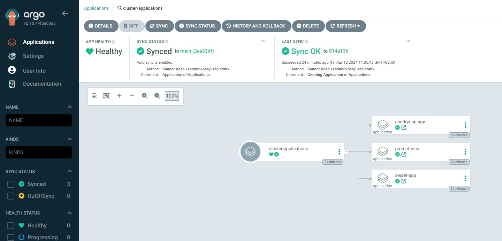

## Day 2 / Section 3

### Updating an Application using the Application of Applications concept

At this moment, we have a test repository, where we use ArgoCD to store the infrastructure k8s deployment package in code according to the basics of GitOps. This essentially means that we do not execute any `kubectl` commands on the k8s cluster directly. Instead, we simply modify the code stored in the repository, and ArgoCD keeps the code stored in the repository and the applications deployed on the cluster in sync.

What's more, thanks to the "Application of Applications" concept, we can't even modify the ArgoCD Application CRDs without skipping the repository, since ArgoCD also continuously synchronizes them with the code stored in said repository. This is true "enforced" GitOps.

But then a legitimate question is how do we modify an application for testing? Let's imagine that we want to change one of the applications, but the change needs to be tested before being put into production. Testing is not done on the main branch, as all other environments with ArgoCD also use/sync the main branch, but we also don't want each of our untested changes to be live on prod systems right away. Furthermore, with the appropriate GitHub settings (branch protection rules) for the main branch, it is not even possible to push changes directly without an approved and tested Pull Request.

So the first step is to create a new branch (feature, fix, etc...) on GitHub. Let's make the changes here. However, changes made on this branch are not synchronized on the k8s cluster by default, since ArgoCD was configured to synchronize the main branch for applications.

So, the second step is to modify the ArgoCD Application definition of the given application on the test cluster so that it is targeting the PR branch. But we also have to make this modification in the repository, since the ArgoCD Application CRD manifest is also located there and synced by ArgoCD.

We introduced a new workflow to solve this challenge. This workflow is primarily effective and safe for application changes managed by ArgoCD.

The main challenges and conditions defined by us the workflow must meet:

- An application change must be testable before the change is implemented on production systems.
- We rely on the Feature Branch Workflow. Our workflow should be in line with this.
- It should be clear to everyone if someone is working with a specific application on a specific environment.
- The workflow must ensure that several people can work independently and at the same time on the same environment with different managed applications.
- The main branch of the repository must contain the current state of the workflow of a given application in a given environment. In this way, a currently running workflow is visible to everyone and is not modified by the automatic pipeline run.
- We assume that the infrastructure pipeline runs once a day, and is also triggered for every merge into the main branch

Our workflow on a timeline:

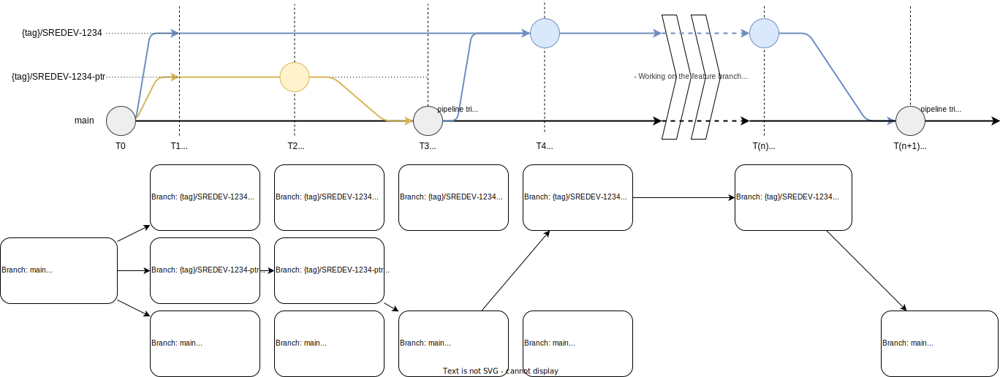

At time T0 we receive a task whose identifier is: SREDEV-1234. We should work
on the environment **{region}-{project}** and application **App1**. ArgoCD, like any
other environment and application, uses the main branch for synchronization by
default as a revision.

At time T1 we open 2 new branches for our task: **{tag}/SREDEV-1234** (feature branch)
and **{tag}/SREDEV-1234-ptr** (pointer branch). This is our branch name convention,
where `{tag}` can be:

- `feat` as a new feature
- `fix` as a bugfix
- `refactor` in case of refactoring
- `docs` as document related changes
- `test` as a test branch, for example of a new feature
- `chore` as chore related changes
- `cicd` as CI/CD related changes
- `perf` as performance related changes

We push those 2 branches immediately.

At time T2, we set `targetRevision` of application to the **feature branch** ({tag}/SREDEV-1234) on the **pointer
branch** ({tag}/SREDEV-1234-ptr), and create a PR so that `main` gets this configuration.

At T3, we merge the **pointer branch** ({tag}/SREDEV-1234-ptr) to `main`, from this moment the **feature branch** ({tag}/SREDEV-1234) is used to
deploy the application.

At T4, as a good measure we revert the `targetRevision` to `main`, so that we do not forget to do so
later. Either way, the `main` branch stays as is, which points to the **feature branch** still.

At T(n), we deliver commits to the **feature branch**, which are then automatically deployed by argocd
only to the environment which we patched with the **pointer branch**.

At T(n+1), we merge the **feature branch** to `main`. All features are now distributed to other
environments too. The **feature branch** is auto-deleted, and that is fine, since at T4 we
reverted already our development environment config.

From this point on, everyone pulling the main branch can see that the revision of the given
application (**App1**) has been modified on the given environment, so someone from
the team is working on it, and the automatically running pipeline always also
sets the new branch (**{tag}/SREDEV-1234**) as `targetRevision`.

We work on the new **feature branch** between T4 and T(n). Thanks to the revision change,
all other environments and applications remain unaffected by the changes made
on the new branch. Before we reach the end of the work process, we make sure
that the modification has been made and works according to the task. We have
opened a new PR, all of the related linters ran without errors, our changes are
reviewed by someone from the team and approved. In other words, everything looks good to merge
the PR into the main branch.

## Day 2 / Section 3 / Lab

### GitOps test

As a first step, let's check that we really have a GitOps setup, meaning that even if we make changes to the cluster without a repository change, ArgoCD will always synchronize our application back according to the code stored in the repository.

We have the `secret-app` on our minikube cluster deployed by ArgoCD. It has only one secret. Let's delete the secret with `kubectl`:

```shell
# get the secret name
$ kubectl -n secret-app get secret
  # Expected output:
  # NAME             TYPE     DATA   AGE
  # my-test-secret   Opaque   1      4d12h

# delete the secret with kubectl
$ kubectl -n secret-app delete secret my-test-secret
  # Expected output:
  # secret "my-test-secret" deleted

# get the secret again
$ kubectl -n secret-app get secret
  # Expected output:
  # NAME             TYPE     DATA   AGE
  # my-test-secret   Opaque   1      24s
```

We are unable to delete the secret, since ArgoCD always recreates it for us according to the code/manifest stored in the repository. This is also true if we only try changing the content:

```shell
# Open the secret for editing
$ kubectl -n secret-app edit secret my-test-secret

# Change the data part of the secret.
# For example change the "data:" to "stringData:" and add a new value for "foo".
# For example:
  # stringData:
  #   foo: test1

# Save your changes and close your editor

  # Expected output:
  # secret/my-test-secret edited

# And now, check the content of your secret again
# The ArgoCD sync can happen between 0 and 3 minutes...
$ kubectl -n secret-app get secret -o yaml

# You will see that the value of the key "foo" has been restored according to the manifest stored on the repository.
```

Now let's try to change the ArgoCD Application CRD without modifying the application. In the default application.yaml we can see, that the automated selfHeal snyc policy option is enabled:

```yaml
  syncPolicy:
    automated:
      selfHeal: true
```

Let's try to change it:

```shell
# Open the ArgoCD application definition of the secret-app for edit
$ kubectl -n argocd edit app secret-app

# search for "selfHeal:" and change it to false:
  # syncPolicy:
  #   automated:
  #     selfHeal: false

# Save and close your editor to save your changes.
  # Expected output:
  # application.argoproj.io/secret-app edited

# Get the value again
$ kubectl -n argocd get app secret-app -o yaml | grep 'selfHeal:'
  # Expected output:
  #       selfHeal: true

# This is the same if you want to change the spec.source.targetRevision from main to an other branch
# You cannot change it manually. It should be change in the repository!
```

### Pointer-branch workflow using ArgoCD

> [!IMPORTANT]
> The pointer-branch workflow as described here is a manual process, which is not automated by any pipeline. It is somewhat error-prone, so we have since developed an automated CI solution for this, which is described [here](https://github.tools.sap/gcs-sre/infrastructure/blob/main/argocd/docs/workflow.md#usage-of-pointer-branch-workflow-branch-deploy-action).

Now, step by step, we will carry out the workflow manually, with the help of which we can modify our ArgoCD applications using a test branch. Lets imagine that we got some task (SREDEV-1234) to change `secret-app` in some way.

Let's use our own "my-argocd-apps" repository (it was created in [Day 1 / Section 1 / Lab](#configure-github-repository-access-for-argocd)) to customize our ArgoCD deployment.

Open a shell console and set the repository URL as an environment variable. We will use this value during the lab:

```shell
# Create the environment variable
# Don't forget to adjust the <your_GitHub_username> to your actual username!
export MY_ARGOCD_REPO=https://github.tools.sap/<your_GitHub_username>/my-argocd-apps.git

# And check the result (my username is sankosa)
$ echo $MY_ARGOCD_REPO
  # Example output:
  # https://github.com/sankosa/my-argocd-apps.git
```

Go to the local directory where your repository is cloned (don't foget to run `git pull` and `git status`) or clone it:

```shell
# Change to the directory where you want to clone the repository
$ cd <choose/a/directory/where/you/want/to/clone>

# Clone the repository
$ git clone $MY_ARGOCD_REPO

  # Expected output:
  # Cloning into 'my-argocd-apps'...
  # remote: Enumerating objects: 23, done.
  # remote: Counting objects: 100% (23/23), done.
  # remote: Compressing objects: 100% (16/16), done.
  # remote: Total 23 (delta 4), reused 18 (delta 2), pack-reused 0
  # Receiving objects: 100% (23/23), done.
  # Resolving deltas: 100% (4/4), done.

# Change the directory to the cloned directory:
$ cd my-argocd-apps/
```

Be sure that you are in your private repository. You can check it with `git status`:

```shell
$ git status

  # Example output:
  # On branch main
  # Your branch is up to date with 'origin/main'.
  # 
  # nothing to commit, working tree clean
```

Let's create a new feature branch

```shell
# Create an environment variable for your branch name
$ export BRANCH_NAME="feat/SREDEV-1234"

# checkout
$ git checkout main

# pull
$ git pull

# Creating working branch
$ git checkout -b "${BRANCH_NAME}"
$ git push origin "${BRANCH_NAME}"

# Creating pointer branch
$ git checkout -b "${BRANCH_NAME}-ptr"
$ git push origin "${BRANCH_NAME}-ptr"
```

Now open the repository in your browser (`https://github.tools.sap/<your_username>/my-argocd-apps`) and refresh the page. Click on branches, and you will see that you have two new branches:

- feat/SREDEV-1234
- feat/SREDEV-1234-ptr

Based on the workflow diagram from earlier, this was the "T1" point.

Now we will change the ArgoCD Application CRD on the `feat/SREDEV-1234-ptr` branch to use the `feat/SREDEV-1234` as a target revision:

```shell
# Checkout the pointer branch
$ git checkout "${BRANCH_NAME}-ptr"
$ git pull
```

Change targetRevision in the `kustomization.yaml` of `secret-app`. This is basically a new kustomization patch:

```shell
$ cat <<EOF >> ArgoCD/overlays/minikube/applications/secret-app/kustomization.yaml
- target:
    kind: Application
    name: secret-app
  patch: |-
    - op: replace
      path: /spec/source/targetRevision
      value: ${BRANCH_NAME}
EOF
```

The `kustomization.yaml` of `secret-app` should now look like this (see the last patch where we changed the targetRevision):

```yaml
---
apiVersion: kustomize.config.k8s.io/v1beta1
kind: Kustomization

resources:
- ../../../../base/applications/app-default/

patches:
# Change name of application - Prereq of application patches executed below
- target:
    kind: Application
    name: .*
  patch: |-
    - op: replace
      path: /metadata/name
      value: secret-app
# Change source repository
- target:
    kind: Application
    name: secret-app
  patch: |-
    - op: replace
      path: /spec/source/repoURL
      value: https://github.com/sankosa/my-argocd-apps.git
# Patching source directory
- target:
    kind: Application
    name: secret-app
  patch: |-
    - op: replace
      path: /spec/source/path
      value: ArgoCD/overlays/minikube/tools/secret-app
# Patching destination namespace
- target:
    kind: Application
    name: secret-app
  patch: |-
    - op: replace
      path: /spec/destination/namespace
      value: secret-app
- target:
    kind: Application
    name: secret-app
  patch: |-
    - op: replace
      path: /spec/source/targetRevision
      value: feat/SREDEV-1234
```

Check it with `kustomize`:

```shell
# Run the following command to see the ArgoCD Application CRD created by kustomize
$ kustomize build ArgoCD/overlays/minikube/applications/secret-app/ | less

# Note that the spec.source.targetRevision has been changed from main to feat/SREDEV-1234
```

Add this change to the pointer branch:

```shell
$ git add ArgoCD/overlays/minikube/applications/secret-app/kustomization.yaml
$ git commit -m "Change secret-app targetRevision to ${BRANCH_NAME}"
$ git push --set-upstream origin "${BRANCH_NAME}-ptr"
```

Now, open your repository in a browser (`https://github.tools.sap/<your_username>/my-argocd-apps`) and refresh the page. Create a new Pull Request using your pointer branch and merge it to the main branch:

- Click on the **Pull Requests** tab
- Click on the **"New Pull Request"** button
- Select the **feat/SREDEV-1234-ptr** branch from the list
- Be sure that the two selected branches for this Pull Request are:`"main"  <--  "feat/SREDEV-1234-ptr"`
- Click on the **"Create pull request"** button
- You can add a title and a description. In this test repo it is not relevant (Note: The infrastructure repo has conventions)
- Click on the **"Create pull request"** button again
- After it is available, click on the **"Merge pull request"** button
- Click on the **"Confirm merge"** button to merge the changes to the main branch
- Click on the **"Delete branch"** button to delete the pointer branch

Now, if you open in your browser the `ArgoCD/overlays/minikube/applications/secret-app/kustomization.yaml` file with the main branch selected, you will see that our new patch to change the `targetRevision` is there. And what is the result? Because it is on the main branch, our ArgoCD `cluster-applications` app will synchronize the code change from the main branch and it wll change the targetRevision of our `secret-app`:

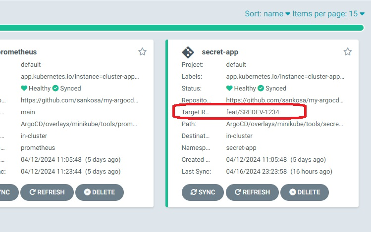

So we can now do our changes on the feature branch `feat/SREDEV-1234` and ArgoCD will synchronize this branch only for the `secret-app` application. Both the repository on the main branch and the ArgoCD Web GUI show that this particular application is under development and is using a special feature branch instead of the main branch.

Now, we will revert the revision change in our `feat/SREDEV-1234` branch.

```shell
$ git fetch
$ git checkout "${BRANCH_NAME}"
$ git merge origin/main
$ COMMIT_ID=$(git log --grep="^secret-app targetRevision" --format=format:%H | tail -n 1)
$ git revert "${COMMIT_ID}"
$ git push
```

This is the tricky part of the workflow. Let's think about what just happened. Open your repository in your browser (`https://github.tools.sap/<your_username>/my-argocd-apps`) and refresh the page. Select the `feat/SREDEV-1234` branch, and open the file `ArgoCD/overlays/minikube/applications/secret-app/kustomization.yaml` with your browser. What is the result? There is no `targetRevision` patch on the `feat/SREDEV-1234` branch of `secret-app`. But if you check it with ArgoCD web GUI or if you get the application manifest with `$ kubectl -n argocd get app secret-app -o yaml | grep targetRevision: | head -n 1`, you can see that ArgoCD still uses the `feat/SREDEV-1234` branch for the synchronization.

This is because the `main` branch contains the `targetRevision` patch to `feat/SREDEV-1234`, and `cluster-applications` synchronizes with the main branch. But when we are done with our work and merge our `feat/SREDEV-1234` feature branch into the main branch, the `targetRevision` patch will disappear again (the feature branch does not have it!) and the main branch will again be the source branch of `secret-app`.

So we are done with points "T2" - "T4". We are at "T(n)", so we can work on our feature and test our changes in real time.

Be sure that you are on the feature branch:

```shell
$ git status
  # Expected output:
  # On branch feat/SREDEV-1234
  # Your branch is up to date with 'origin/feat/SREDEV-1234'.

  # nothing to commit, working tree clean
```

Let's change the secret app. We will just add a new "key:value" to our existing secret:

```shell
$ cat <<EOF > ArgoCD/base/tools/secret-app/secret.yaml
---
apiVersion: v1
kind: Secret
metadata:
  name: my-test-secret
type: Opaque
stringData:
  foo: bar
  my-new-key: my-new-value
EOF
```

And push it to the feature branch to see how ArgoCD works now in case of this app:

```shell
$ git add ArgoCD/base/tools/secret-app/secret.yaml
$ git commit -m "Extend secret with new key:value pair"
$ git push
```

And now, let's see the magic. We have updated the secret on the feature branch `feat/SREDEV-1234`. We told ArgoCD to synchronize with this feature branch, thus, we expect that the deployed secret should also have the new key:value pair (ArgoCD needs 0-3 mins for sync):

```shell
$ kubectl -n secret-app get secret my-test-secret -o yaml | grep 'my-new-key:' | awk '{print $2}' | base64 -d
```

And indeed it shows up! We have the new key:value pair and we didn't even need to touch the cluster directly!

Now, let's imagine that we are done with our job. We have opened the pull request, all of the checks are looking good. We have also tested the application after the changes and someone has already reviewed the change. So, everything is ready take our changes into production. In this instance, we can merge our feature branch into the main branch so that all of the other clusters which are using the main branch will sync our changes.

Open your repository in your browser (`https://github.tools.sap/<your_username>/my-argocd-apps`) and refresh the page. Create a new pull request using your feature branch and merge it into the main branch:

- Click on the **Pull Requests** tab
- Click on the **"New Pull Request"** button
- Select your **feat/SREDEV-1234** branch from the list
- Be sure that the two selected branches for this Pull Request are: `"main"  <--  "feat/SREDEV-1234"`
- Click on the **"Create pull request"** button
- You can add a title and a description. In this test repo it is not relevant (Note: infrastructure repo has conventions)
- Click on the **"Create pull request"** button again
- After it is available, click on the **"Merge pull request"** button
- Click on the **"Confirm merge"** button to merge the changes to the main branch
- Click on the **"Delete branch"** button to delete the feature branch

Now if you open in your browser the `ArgoCD/overlays/minikube/applications/secret-app/kustomization.yaml` file on the main branch, you will see that we don't have the `targetRevision` patch anymore. `cluster-applications` will synchronize the ArgoCD Application CRD of `secret-app` from the main branch and the `targetRevision` will be changed back to `main` (ArgoCD needs 0-3 mins for sync):

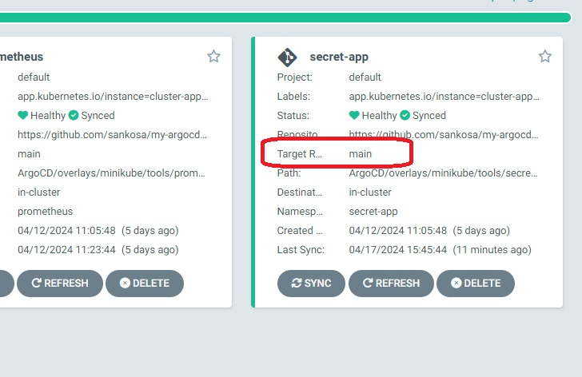

You can also run the `kubectl -n argocd get app secret-app -o yaml | grep targetRevision: | head -n 1` command to see this result.

And we are done! This is how the ArgoCD workflow works.

## Day 2 / Extra session

### Playing with ArgoCD Web GUI
